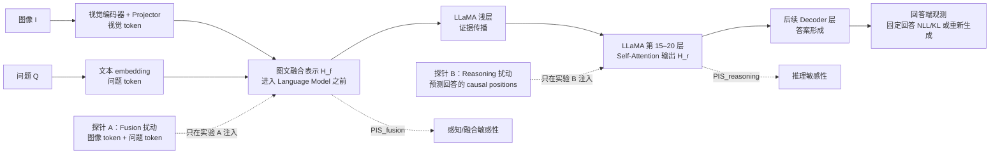
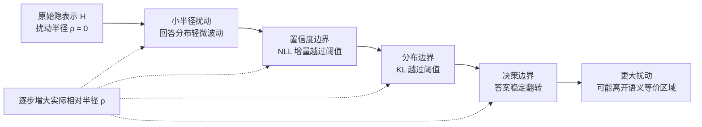

# 阶段汇报：相关论文的有效性质疑与 MALP 方法设计

---

## 引言：已开展工作概述

本阶段首先完整复现了三类代表性不确定性量化（UQ）方法，并以此为切入点对其方法机制与评价构念进行了严格的有效性检验。

| 论文 | 方法思路 | 复现情况 |
|---|---|---|
| Semantic Entropy（Farquhar et al., 2024, *Nature*） | 高温多次采样 + 双向蕴含语义聚类 + 簇熵 | 良好。TriviaQA/Mistral-7B 上 AUROC 0.7847，与原文 ~0.79 一致 |
| VL-Uncertainty（Zhang et al., 2024） | 图像高斯模糊 + 文本改写的图文联合扰动 + 语义簇熵 | MM-Vet/LLaVA-1.5-7B 上幻觉检测准确率 79.82%，原文 82.11%（−2.29 pp），AUROC 0.7881 |
| VAUQ（Park et al., 2026） | 预测熵 + 注意力核心视觉 token 遮蔽 + Image-Information Score | ViLP/MM-Vet/CVBench/LLaVA-1.5-7B，多数指标低于原文（ViLP −13.41 pp 最为显著） |

# 第一部分　问题总结

## 一、对 VL-Uncertainty 的有效性质疑

### 1.1 高斯模糊并非"语义等价"扰动，而是信息退化

论文将高斯模糊定义为语义等价扰动（不增删物体、不改空间结构），认为模糊只是"引出"模型的内在不确定性。但这一论证混淆了"物理世界的物体恒常性"与"视觉信息可用性"：

- 随模糊半径增大，细粒度纹理、边缘、OCR 文字、小物体、精确计数与颜色边界被**不可逆破坏**；
- 对于"图中是什么动物"等大物体识别，模糊或许仍语义等价；但对于 OCR、计数、空间+属性类问题，模糊**直接移除了回答所需的关键信息**，绝非语义等价；
- 
- 论文自身消融显示模糊（82.11%）显著优于旋转（70.18%）、平移、裁剪等扰动。若模糊只是"另一种语义等价扰动"，不应与其他语义等价扰动差距如此之大——更简洁的解释是：**模糊最有效地破坏了视觉信息，从而"制造"了而非"引出"了不确定性**。

**核心替代假设**：VL-Uncertainty 的性能主要来自模糊造成的信息退化程度差异——视觉敏感问题（恰好也更容易出错）被打成高熵幻觉，视觉不敏感问题被打成低熵非幻觉。分数更接近"任务对细粒度视觉信息的依赖程度"，而非"模型对视觉内容的内在不确定"。

### 1.2 图文联合分数的归因不清，文本扰动可能主导

## 二、对 VAUQ 的有效性质疑

### 2.1 注意力核心区域缺乏额外价值（已有实验证据）

VAUQ 的核心机制是：按注意力选出 top-K 视觉 token，遮蔽后看熵变化，认为注意力高的 token 就是"支撑回答的关键视觉证据"。但**注意力是统计关联，不是因果贡献**——高注意力可能来自位置偏置、padding token 等无关因素。

为此设计了严格对照实验（同一回答、同一标签、同一原图 entropy，仅遮蔽策略不同），五随机种子结果如下：

| 数据集 | Core | Blank（全消融） | Random（5 种子均值） | Δ_core−random | 结论 |
|---|---:|---:|---:|---:|---|
| ViLP | 65.71 | **67.11** | 65.96 ± 0.10 | −0.26 | Blank 最好，Core 反而低于 Random |
| MMVet | **85.31** | 82.26 | 83.83 ± 0.56 | +1.48 | Core 略优，但仅高 ~1.5 点 |
| CVBench | **68.77** | 66.22 | 68.55 ± 0.10 | +0.23 | Core 与 Random 几乎相同 |

**关键发现**：在五个随机种子下，注意力核心区域相对等面积随机遮蔽**没有跨数据集稳定且显著的优势**——ViLP 上方向相反，CVBench 上差异接近零。更值得注意的是 CVBench 上 VAUQ（68.77）几乎没有超过原始预测熵（68.74）。这说明：**遮蔽一定数量的视觉信息本身就能产生大部分效果，注意力 top-K 定位只带来很小且依赖数据集的边际变化。**

### 2.2 把"回答错误"等同于"视觉幻觉"（构念混淆）

论文对所有数据集的标签构造方式是：用语言模型判断回答是否与标准答案语义等价——正确即非幻觉，错误即幻觉。因此其标签实际是：

$$E = \mathbb{1}[\text{模型回答与标准答案不一致}], \qquad \text{AUROC} = \text{AUROC}(s_{\mathrm{VAUQ}}, E)$$

即测的是**回答正确性的区分能力**。但"回答错误"与"视觉幻觉"并不等价：

| 类型 | 答案是否正确 | 是否含视觉幻觉 | 说明 |
|---|:---:|:---:|---|
| A | 是 | 否 | 视觉观察与答案均正确 |
| B | 是 | 是 | 答案正确，但附带错误视觉描述 |
| C | 否 | 否 | 视觉观察正确，但推理/计算/格式错误 |
| D | 否 | 是 | 回答含错误视觉事实，答案也错 |

论文标签会把 **B 类（答案对但有幻觉）误标为非幻觉**，把 **C 类（答案错但无视觉幻觉）误标为幻觉**。因此 VAUQ 的不确定性分数反映的更接近**正确率而非幻觉率**。

## 三、不确定性量化系列论文的共性问题

除VAUQ外，VL-Calibration 、VL- Uncertainty一系列工作与 VAUQ 相同

1、**直接将模型回答的正误与是否存在幻觉等同**。在统计校准（ECE、Brier Score 等)时，正例被定义为"错误回答"，因此这些工作实质上校准的是"预测正确率的可信度"，而非"幻觉风险的可信度"。这与考核题目明确强调的"幻觉 ≠ 所有错误"存在系统性偏差——**一个方法即便能完美预测错误率，也未必能识别幻觉**。

2、对文本扰动和对图像扰动可能在语义上并不等价，人为制造了不确定性，导致了看似高正确率的幻觉检测结果

3、扰动带来的变化不直接反映不确定性或幻觉率，应该反映的是模型对某些上下文的依赖程度（VL—Uncertainty、VAUQ)

---

# 第二部分　研究方向

## 一、研究问题与选题定位

通过阅读文献，我发现目前该领域研究存在以下难题：

1、不确定性不能完全反映幻觉

| 场景分类 | 底层不确定度 | 实际回答质量 | 属于幻觉吗？ |
|----------|-------------|-------------|:-----------:|
| 高确定，且正确 | 极低 | 准确无误 | 否 |
| 心虚式编造 | 极高 | 事实错误 | 是（经典幻觉） |
| 多样化创作 | 极高 | 逻辑自洽的创作 | 否 |
| **过度自信的谎言** | **极低** | **貌似合理的错误** | **是（硬幻觉/重度幻觉）** |

2、许多不确定性方法的理论不严谨，涉及到大模型的可解释性，仍是行业难题

3、不能直接依靠数据集的标签判断是否存在幻觉（通常需要LLM as Judge），工程实现困难

基于上述问题，结合考核要求，本阶段确定研究选题为：

> **如何改进不确定性量化方法，以识别多模态大模型的高置信度幻觉（high-confidence hallucination）？**

## 二、MALP 方法设计（<u>M</u>odality-<u>A</u>ttributed <u>L</u>atent <u>P</u>erturbation）

背景：

1、**图像领域的对抗训练（AdvT）**： 在图像处理中，对抗训练通过在输入像素上加入极其微小的、人类无法察觉的扰动来使模型分类出错，以此进行训练可以作为极佳的正则化手段，显著提升模型的泛化能力和鲁棒性。

2、**NLP 领域的困境（离散性）**： 文本由离散的词（Symbol）组成，无法像图像那样直接对输入计算梯度并施加微小的连续扰动。

3、**前人方案（Miyato 等人, 2017）**： Miyato 等人提出直接将对抗扰动施加在**连续的词嵌入（Word Embedding）空间**，而不是离散的文本上。该方法（称为 **AdvT-Text**）在多项文本分类任务上取得了 SOTA 性能，起到了极佳的正则化效果。

### 2.1 核心思想

MALP 将扰动从**像素空间/文本空间**移到**模型的隐空间（latent space）**：对模型内部表示施加有界的、范数/方向保持的小扰动，固定原回答做 teacher-forcing，测量扰动前后模型对原回答置信度（NLL）的变化。其不确定性分数记为 **PIS（Perturbation Influence Score）**：

$$\operatorname{PIS} = \frac{1}{K}\sum_{k=1}^{K}\big(\mathcal{L}_{\text{perturbed}}^{(k)} - \mathcal{L}_0\big), \qquad \mathcal{L} = -\frac{1}{L}\sum_l \log P(y_l\mid y_{<l})$$

辅助以回答 token 分布的 KL 散度。MALP 同时对视觉表示和文本表示**分别扰动、分别计分**，实现模态归因。

### 2.2 MALP 如何逐一解决前述问题

| 前述问题 | MALP 的对应设计 |
|---|---|
| 高斯模糊与视觉patch屏蔽破坏信息、非语义等价 | **隐空间有界扰动**，扰动后表示仍在原表示的局部邻域内，不破坏可用信息——这才是真正意义下的"语义等价扰动" |
| 图文联合分数无法归因 | **模态分离**：视觉/文本表示各自独立扰动， |
| 把错误等同于幻觉 | **面向幻觉的评价设计**：采用多模态 judge 独立给出 correctness 与 MMHal-Bench 0–6 rating，幻觉由 `rating < 3` 确定性导出 |

---

### 2.3 隐空间扰动的语义等价验证：

| **物理量**           | **数学表示**                                     | **核心代表**                               | **实际应用**                                   |
| -------------------- | ------------------------------------------------ | ------------------------------------------ | ---------------------------------------------- |
| **方向 (Direction)** | 单位向量 $\frac{\vec{v}}{\Vert{}\vec{v}\Vert{}}$ | **是什么**（语义、类别、属性、概念）       | 计算相似度（余弦相似度）、语义推理（向量加减） |
| **长度 (Length)**    | 模长/范数 $\Vert{}\vec{v}\Vert{}$                | **多强烈**（重要性、确定性、频次、置信度） | 衡量特征强度、过滤噪声、计算欧氏距离           |

为验证 MALP 的隐空间扰动是否仍处于原语义的局部邻域，在集群上部署主流中英多语 embedding 模型 **BAAI/bge-m3**，选取“猫、狗、苹果、汽车、快乐、悲伤、cat、airplane”8 个中英文词进行初步验证。实验先将词编码为归一化向量，再分别施加 MALP 中的两类扰动：

1. **随机方向、固定相对长度扰动（`norm_isotropic`）**：采样各向同性高斯方向，将噪声长度缩放到原向量范数，按强度 $\sigma$ 相加后再投影回原范数；
2. **沿原向量方向的长度扰动（`directional`）**：令 $\tilde{e}=e+\sigma\alpha e=(1+\sigma\alpha)e$，其中 $\alpha\sim\mathcal{N}(0,1)$。

#### 中等扰动强度 $\sigma=0.5$

| 输入词 | 原始语义近邻（排除自身） | `norm_isotropic` 扰动后近邻 | 与原向量余弦 | `directional` 扰动后近邻 | 与原向量余弦 |
|---|---|---|---:|---|---:|
| 猫 | 小猫 | 小猫 | 0.8884 | 小猫 | 1.0000 |
| 狗 | dog | dog | 0.8964 | dog | 1.0000 |
| 苹果 | apple | apple | 0.9002 | apple | 1.0000 |
| 汽车 | car | car | 0.8896 | car | 1.0000 |
| 快乐 | happy | happy | 0.8945 | happy | 1.0000 |
| 悲伤 | 难过 | 难过 | 0.8917 | 难过 | 1.0000 |
| cat | 猫 | 猫 | 0.8950 | 猫 | 1.0000 |
| airplane | 飞机 | 飞机 | 0.8983 | 飞机 | 1.0000 |

结果表明，`norm_isotropic` 将扰动向量与原向量的余弦相似度降低至 **0.8884–0.9002**，但 8 个词的 top-1 语义近邻均未改变；完整 top-5 也仍主要由同义词、上下位概念或中英互译构成。例如，“猫”的 top-5 为“猫、小猫、cat、kitten、宠物”，“快乐”的 top-5 为“快乐、happy、joyful、开心、高兴”。这说明在当前样本、候选集和 $\sigma=0.5$ 设置下，随机方向固定长度扰动改变了表示方向，但尚未明显破坏词级语义。

`directional` 的余弦相似度均约为 1，近邻排序基本不变。

### 2.4 改变扰动位置以区分感知不确定性和推理不确定性

同一个错误回答可能来自两类不同的不稳定性：一类发生在模型读取图像、理解问题并形成联合表征的过程中，即**感知/融合不确定性**；另一类发生在视觉与文本证据已经进入语言模型之后，由多步推理、答案组织或自回归生成引起，即**推理不确定性**。如果只在模型输入端或最终输出端计算一个总分，这两种来源会混合在一起，无法回答“模型是没有看清，还是看清后推错了”。

MALP 因此不改变输入图像和问题，而是在同一条前向计算链的两个位置分别设置独立的局部扰动探针：

*图：MALP 的双位置扰动探针。实验 A 与实验 B 独立运行，分别测量回答对融合表示和中间推理表示的局部敏感性。*

图中的两个探针不是在一次前向中先后叠加，而是从**同一个未扰动样本、同一个固定回答和同一组随机种子**出发，分别运行两组反事实实验。这样，一个阶段的分数不会混入另一个阶段的扰动效应。

### 2.5 通过扰动半径量化模型的不确定性边界

前述 MALP 在固定扰动强度 $\sigma$ 下比较扰动前后的 NLL、KL 或答案一致性，回答的是“模型在给定扰动下有多敏感”。但固定 $\sigma$ 存在两个局限：一是不同样本、不同阶段的 hidden state 尺度不同，同一个 $\sigma$ 未必代表同样大小的实际扰动；二是单点敏感性无法描述模型从稳定到失稳的完整过程。MALP 的另一个研究方向，是将扰动强度从一个固定超参数扩展为连续扫描变量，通过寻找回答开始显著变化的**最小扰动半径**，量化模型的不确定性边界。

其核心直觉是：如果一个回答只需极小的隐空间扰动就会改变，说明该样本距离模型的局部决策边界很近，模型不确定性较高；反之，如果较大扰动下回答仍保持稳定，则说明其局部稳定区域较大、不确定性较低。

*图：沿隐空间扰动半径逐步外扩，模型可能依次出现置信度下降、分布偏移和最终答案翻转。三种边界不必同时出现，也不要求严格按图中顺序发生。

#### 2.5.1 高 NLL 错误回答与正确回答的对照实验

为检验“高 NLL”是否必然意味着视觉表示对扰动敏感，进一步在 ViLP 50 条无扰动
记录中分别选取两组样本：

- 预测与 reference 不一致的样本中，原始平均 NLL 最高的 5 条；
- 预测与 reference 严格匹配的样本中，原始平均 NLL 最高的 5 条。

两组均使用 `norm_isotropic`、`sigma=0.1`，分别在 Projector 前和 Projector 后
扰动，并同时计算重新 greedy 生成的描述是否改变，以及固定原始回答的 teacher-forcing
NLL 增量。

正确高 NLL 组的筛选结果为：

| 样本 | 模型回答 / reference | 原始 mean NLL |
|---|---|---:|
| `vilp-2-case1` | Octagon / Octagon | 0.720622 |
| `vilp-14-case1` | 6 / 6 | 0.696370 |
| `vilp-12-case2` | Snake / Snake | 0.484894 |
| `vilp-1-case2` | Cube / Cube | 0.475560 |
| `vilp-0-case1` | 4 / 4 | 0.413397 |

扰动后的结果如下：

| 样本 | Projector 前描述 | 前 ΔNLL | Projector 后描述 | 后 ΔNLL |
|---|---|---:|---|---:|
| `vilp-2-case1` | Octagon | +0.006287 | Octagon | −0.005201 |
| `vilp-14-case1` | 6 | −0.002950 | 6 | −0.010951 |
| `vilp-12-case2` | Snake | +0.005887 | Snake | +0.005019 |
| `vilp-1-case2` | Cube | +0.002877 | Cube | −0.003839 |
| `vilp-0-case1` | 4 | +0.002322 | 4 | +0.001424 |

5 个正确高 NLL 样本在两处扰动下的生成描述均未改变。Projector 前的平均 ΔNLL
为 **+0.002884**，Projector 后的平均 ΔNLL 为 **−0.002710**。与上一组错误高
NLL 样本相比，二者都表现出较小的局部 NLL 响应；因此单点平均 NLL 反映的是模型
对自身回答的 token 置信度，不等价于视觉隐空间的扰动敏感性，也不能单独判断回答
是否接近决策边界。

完整结果保存在：

- 错误高 NLL 组：`results/malp/vilp5_high_nll_wrong_sigma01.json`；
- 正确高 NLL 组：`results/malp/vilp5_high_nll_correct_sigma01.json`。

进一步将同一 10 个样本的扰动强度提高到 `sigma=0.5`。错误高 NLL 组中，只有
`vilp-1-case1` 的 Projector 前描述从 `Hexagon` 变为 `Cube`，其余生成描述保持
不变；正确高 NLL 组 5 个样本的生成描述均保持不变。

| 样本组 | Projector 前描述变化 | Projector 前平均 ΔNLL | Projector 后描述变化 | Projector 后平均 ΔNLL |
|---|---:|---:|---:|---:|
| 错误高 NLL（5 条） | 1/5 | +0.012128 | 0/5 | −0.016179 |
| 正确高 NLL（5 条） | 0/5 | +0.043858 | 0/5 | −0.020580 |

这组强扰动结果说明，增大半径后 teacher-forcing NLL 对 Projector 前扰动的响应明显
增强，但生成文本的离散翻转仍然很少；Projector 后的平均 ΔNLL 在两组中反而为负，
表示扰动后模型对原回答的概率没有系统性下降。因而不能仅凭单次强度下的 NLL 增量
判断错误与正确样本的决策边界距离，仍需多随机种子、多 sigma 网格和答案翻转率联合
分析。

对应结果为：

- 错误高 NLL、`sigma=0.5`：`results/malp/vilp5_high_nll_wrong_sigma05.json`；
- 正确高 NLL、`sigma=0.5`：`results/malp/vilp5_high_nll_correct_sigma05.json`。

继续将同一 10 个样本的扰动强度提高到 `sigma=1.0`，结果如下：

| 样本组 | Projector 前描述变化 | Projector 前平均 ΔNLL | Projector 后描述变化 | Projector 后平均 ΔNLL |
|---|---:|---:|---:|---:|
| 错误高 NLL（5 条） | 2/5 | +0.060127 | 1/5 | −0.042322 |
| 正确高 NLL（5 条） | 0/5 | +0.062906 | 1/5 | −0.033657 |

错误高 NLL 组中，Projector 前的两个生成翻转为：`8→10`、`Hexagon→Cube`；
Projector 后的一个翻转为：`Snake→Yes`。正确高 NLL 组中，只有 Projector 后的
`Snake→Yes` 发生翻转，其余回答保持不变。随着 `sigma` 从 0.1 增加到 0.5、1.0，
Projector 前的平均 ΔNLL 和错误组的生成翻转率总体上升；Projector 后的平均 ΔNLL
仍可能为负，表明不同注入位置的响应方向并不一致。

对应结果为：

- 错误高 NLL、`sigma=1.0`：`results/malp/vilp5_high_nll_wrong_sigma1.json`；
- 正确高 NLL、`sigma=1.0`：`results/malp/vilp5_high_nll_correct_sigma1.json`。

MALP方法重点参考文献：

#### *Embedding Perturbation may Better Reflect the Uncertainty in LLM Reasoning* (2026)

- **核心思想**：在大模型的多步推理（Reasoning）中，如何提前检测出模型是否在胡说八道（产生幻觉）？该论文提出了一种利用**嵌入空间扰动**进行不确定性量化（UQ）的新颖视角。
- **方法机制**：在推理过程中，对前一个 Token 的嵌入向量（Embedding）施加微小的扰动。
- **主要结论**：研究发现，当大模型处于**错误的推理步骤**时，其后续生成的 Token 对前驱 Token 嵌入空间的扰动高度敏感。通过这种扰动测试，可以有效衡量模型的“中间不确定性”，从而提前预测并拦截错误的生成。

### 数学本质：决策边界的距离证明

论文在第 3.3 节给出了非常漂亮的数学证明 ： 作者证明了这两种扰动 (随机和对抗）度量方式，在数学上都**等价于近似计算当前嵌入 H 到模型决策边界（Decision Boundary）的几何距离 γ(H)** ：

- 随机扰动 Pert.(xt) 近似于梯度范数的平方 σ^2^∥δ∥^2^~2~ 。
- 对抗扰动 Pert.(xt) 近似于梯度范数 α∥δ∥~1~ 。

当模型在某个推理步骤中非常纠结、存在多个互相竞争的候选路径（比如正在犹豫该写正确答案还是落入陷阱）时，当前的嵌入向量就会**极度贴近决策边界** 。此时，只要施加这两种微小的向量扰动，模型就会产生强烈的“动摇”（表现为生成概率骤降，或向另一个 Rival Token 倾斜） 。因此，通过测量这种敏感度，就能精准识别出模型开始犯错或不确定的那个关键推理步骤 。
