# 多模态大语言模型的不确定性量化评估与低不确定性幻觉检测

## 摘要

多模态大语言模型（MLLM）的不确定性量化通常假设，高生成置信度或跨采样一致性意味着更可靠的预测。然而，模型可能稳定且高置信地生成缺乏视觉证据支持的内容，形成**低不确定性幻觉（Low-Uncertainty Hallucination, LUH）**。在本工作中，我研究现有不确定性量化方法能否识别此类幻觉，并探索一种基于证据归因的互补信号。我在 LLaVA、Qwen2.5-VL 和 InternVL 三种 MLLM 以及 ViLP、HallusionBench 和 MM-Vet 三个基准上，对 6,667 条有效回答分别进行正确性与幻觉的独立标注。我发现正确性与幻觉是不同的评估目标，22.8% 的样本在两种标签之间发生错配；同时，Perplexity、Semantic Entropy 和 UMPIRE 对幻觉的检测性能始终弱于对答案错误的检测，并留下大量自信生成的幻觉未被检测到。针对三种基线方法的共同盲区，我构建了一个低不确定性困难子集，并提出 **ERA（Early Rationale Attribution）**。ERA 衡量模型置信度的来源：在早期解码器层，它比较答案生成分配给外部证据（图像和问题）的注意力与分配给自生成的视觉描述和推理的注意力。在三个模型的困难子集上，ERA 的 AUROC 分别达到 **0.708、0.618 和 0.591**，相较最优基线绝对提升 **0.232、0.119 和 0.088**。总体而言，**预测稳定性并不意味着证据支持**；追溯模型置信度的来源为识别低不确定性幻觉提供了一种互补信号。项目代码开源于：https://github.com/lexiangrui/uncertainty-quantification-mllm 。

## Abstract

A common assumption in uncertainty quantification (UQ) for multimodal large language models (MLLMs) is that high generation confidence or strong consistency across repeated samples indicates reliable predictions. However, an MLLM can confidently and consistently produce content unsupported by visual evidence, which I call **low-uncertainty hallucinations (LUHs)**. In this work, I investigate whether existing UQ methods can detect such failures and explore a complementary signal based on evidence attribution. I evaluate LLaVA, Qwen2.5-VL, and InternVL on ViLP, HallusionBench, and MM-Vet, and independently annotate correctness and hallucination for 6,667 valid responses. I find that correctness and hallucination are distinct evaluation targets: 22.8% of the responses have mismatched correctness and hallucination labels. Perplexity, Semantic Entropy, and UMPIRE are consistently less effective at detecting hallucinations than at detecting answer errors, leaving a substantial number of confidently generated hallucinations undetected. To address the shared blind spots of these baselines, I construct a challenging low-uncertainty subset and introduce **Early Rationale Attribution (ERA)**. ERA measures where the model's confidence comes from: at early decoder layers, it compares the attention allocated by answer generation to external evidence (the image and question) with the attention allocated to self-generated visual descriptions and reasoning. On the challenging subsets, ERA achieves AUROCs of **0.708, 0.618, and 0.591** across the three models, outperforming the strongest baselines by **0.232, 0.119, and 0.088**, respectively. Overall, prediction stability does not imply evidential support, and tracing the origin of model confidence provides a complementary signal for detecting low-uncertainty hallucinations. Code is available at https://github.com/lexiangrui/uncertainty-quantification-mllm.


## 目录

- [摘要](#摘要)
- [Abstract](#abstract)
- [1. 研究问题提出](#1-研究问题提出)
  - [1.1 研究背景与问题定义](#11-研究背景与问题定义)
  - [1.2 多模态幻觉的评测研究](#12-多模态幻觉的评测研究)
  - [1.3 从语言模型不确定性到多模态不确定性](#13-从语言模型不确定性到多模态不确定性)
  - [1.4 现有研究的共性问题](#14-现有研究的共性问题)
  - [1.5 研究问题与实验路线](#15-研究问题与实验路线)
- [2. 实验一：UQ 评估框架设计](#2-实验一uq评估框架设计)
  - [2.1 评测模型与数据集](#21-评测模型与数据集)
  - [2.2 回答生成与标注](#22-回答生成与标注)
  - [2.3 基线方法与评估指标](#23-基线方法与评估指标)
- [3. 实验一：评估结果分析与低不确定性子集提取](#3-实验一评估结果分析与低不确定性子集提取)
  - [3.1 描述性统计](#31-描述性统计)
  - [3.2 错误与幻觉检测性能](#32-错误与幻觉检测性能)
  - [3.3 低不确定性幻觉盲区](#33-低不确定性幻觉盲区)
  - [3.4 典型案例分析](#34-典型案例分析)
  - [3.5 低不确定性困难子集](#35-低不确定性困难子集)
- [4. 实验二：ERA 早期推理归因不确定性量化方法设计](#4-实验二era-早期推理归因不确定性量化方法设计)
  - [4.1 方法动机](#41-方法动机)
  - [4.2 五类语义区域划分](#42-五类语义区域划分)
  - [4.3 答案到不同证据区域的注意力归因](#43-答案到不同证据区域的注意力归因)
  - [4.4 ERA 不确定性分数](#44-era-不确定性分数)
  - [4.5 单次前向计算流程](#45-单次前向计算流程)
- [5. 实验二：实验结果对比与分析](#5-实验二实验结果对比与分析)
  - [5.1 ERA 幻觉检测性能](#51-era-幻觉检测性能)
  - [5.2 ERA 分数的区分能力](#52-era-分数的区分能力)
  - [5.3 典型案例分析](#53-典型案例分析)
- [6. 局限性与下一步工作](#6-局限性与下一步工作)
  - [6.1 局限性](#61-局限性)
  - [6.2 下一步工作](#62-下一步工作)
- [附录 A：补充说明与消融实验](#附录-a补充说明与消融实验)
- [附录 B：实验详细数据](#附录-b实验详细数据)
- [参考文献](#参考文献)

## 1. 研究问题提出

### 1.1 研究背景与问题定义

多模态大语言模型（Multimodal Large Language Model，MLLM）能够根据图像和文本生成开放式回答，但其输出可能偏离输入证据或客观事实。参考相关研究 [8]，本报告采用如下定义：

> **MLLM 幻觉是指模型在感知与推理过程中生成了与输入视觉内容、问题或上下文相矛盾，无法由其合理推导，或与可验证现实世界知识不一致的事实性内容。**

幻觉不等同于一般错误。计算、公式选择、逻辑推导或选项映射错误，若未引入符合上述条件的事实性内容，均不标记为幻觉；反之，即使最终答案正确，只要感知或推理过程满足上述条件，仍标记为幻觉。本文据此分别定义正确性标签与幻觉标签：

\[
C_i=\mathbb{1}[\text{最终答案与参考答案一致}],\qquad
H_i=\mathbb{1}[\text{感知或推理过程满足上述任一幻觉条件}]。
\]

\(C\) 与 \(H\) 相互独立，可形成四种组合。该设计能够区分“答错但未幻觉”与“答对但含幻觉”两类样本，避免以答案正误替代幻觉标签。

不确定性量化（Uncertainty Quantification，UQ）是指利用生成概率、重复采样、内部表示或模型自评估等信号，为给定输入及其回答计算不确定性分数，以描述模型对该回答缺乏确定性的程度 [10]。本文统一规定：UQ 分数越高，表示模型越不确定。

不确定性与幻觉相关，但二者并不等价。不确定性描述模型预测分布或内部状态的稳定程度，幻觉则描述回答中的事实性内容是否得到输入与可靠知识支持。高不确定性可能来自图像模糊、问题歧义或存在多个合理答案，此时不一定发生幻觉；低不确定性也只表示模型形成了稳定预测，不能保证该预测具有事实依据。已有研究同样表明，UQ 与幻觉之间的关联会随任务、模型和幻觉类型变化 [7]。

模型可能因语言先验、稳定的错误视觉表征或其他系统性偏差，高概率地重复生成同一幻觉。对给定 UQ 方法，本文将这种情况定义为**低不确定性幻觉（Low-Uncertainty Hallucination，LUH）**：

> **回答被独立判定为存在幻觉，但该 UQ 方法仍将其置于所属模型的低不确定性区域。**

LUH 是幻觉检测的漏报，反映该 UQ 方法未能识别模型稳定生成的无依据内容。

按照不确定性水平与是否包含幻觉，可将模型回答分为四类：

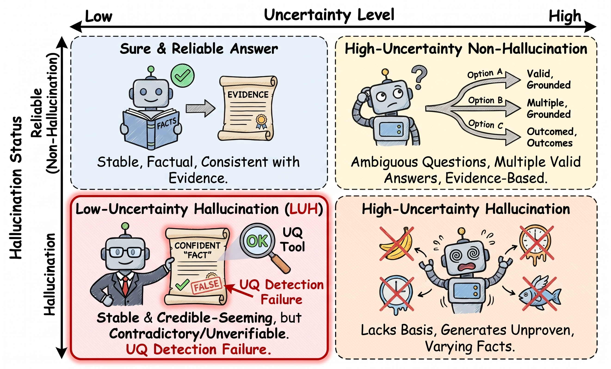

### 1.2 多模态幻觉的评测研究

多模态幻觉的评测经历了从“物体存在性核对”到“开放式回答的证据支持度评估”的演进，评测对象也从最终答案逐步扩展为完整回答内容。早期研究主要关注图像描述中的物体幻觉：Rohrbach 等人提出 CHAIR，通过将生成描述中提及的物体与图像中实际存在的物体逐一比对，计算幻觉物体占全部提及物体的比例 [18]，开创了以“视觉证据核对”为核心的评测范式，但受限于固定的物体类别集合（如 MSCOCO 的 80 类），且结果易受指令设计与描述长度影响。进入多模态大模型时代后，Li 等人提出 POPE，将物体幻觉检测转化为“图像中是否存在某物体”的 Yes/No 轮询二分类任务 [1]：正问题基于图像中真实存在的物体构造，负问题则从未出现物体中采样，并按随机、高频与对抗三种负采样策略划分子集；研究发现，训练数据中高频出现或经常共现的物体更容易被模型以幻觉形式生成，提示多模态幻觉可能源于稳定的语言与共现先验，而非仅来自视觉感知噪声。MME 等综合评测基准进一步将物体存在性、计数、位置、颜色等感知子任务纳入统一的轮询式评测框架 [19]。

随着评测对象的细化，研究者将物体级幻觉归纳为三类：类别幻觉（识别出图像中不存在的物体类别）、属性幻觉（物体类别正确，但对颜色、形状、材质、数量等属性的描述错误）与关系幻觉（物体及其属性均正确，但物体之间的交互或相对位置与图像不符）。上述分类表明，幻觉并不局限于“说了不存在的东西”，也包括“把存在的东西说错”；因此，仅核对最终答案是否匹配参考标准，无法覆盖属性与关系层面的无依据内容。

**开放式幻觉评测。** 轮询式评测难以刻画开放式回答中的复杂幻觉。MMHal-Bench 构建了覆盖对象属性、计数、空间关系等八类问题的开放式问答集，并引入 GPT-4 作为裁判，按 0–6 量表对回答进行分级评分 [8]，将“幻觉检测”从规则匹配转向“由更强模型判断回答是否得到证据支持”。HallusionBench 则从诊断视角出发，将问题划分为 Visual Dependent（必须依赖视觉上下文才能回答）与 Visual Supplement（无视觉输入也可回答，视觉仅起补充或纠正作用）两类，系统考察视觉错觉、语言先验、错误前提与图文冲突等情形 [9]；其 VS 设置直接检验模型在“语言先验与图像证据冲突”时是否被先验主导。此外，GAVIE 等方案验证了 GPT-4 在开放式幻觉评估上的可行性 [20]，HaELM 则尝试训练专门的幻觉检测模型，以降低对通用大模型的依赖 [21]。

**评测范式的演进与本研究的衔接。** 总体来看，多模态幻觉评测从基于规则的物体比对（CHAIR），发展到判别式轮询（POPE、MME），再到由更强模型辅助的开放式评估（MMHal-Bench、GAVIE、HaELM），评测对象也从“最终答案是否匹配”扩展为“完整回答是否得到输入证据支持”。然而，上述工作也表明，单一正确率不能充分描述 MLLM 的可信性：一方面，开放回答可能在结论正确时附带错误的视觉细节；另一方面，模型也可能在视觉观察完全正确时因推理或计算失误而答错，此类错误在 1.1 节的定义下并不构成幻觉。因此，要研究 UQ 是否能够预测幻觉，必须使用独立于正确性的幻觉标注，并保留模型的视觉观察、推理过程和最终答案，才能定位幻觉实际发生的位置。

### 1.3 从语言模型不确定性到多模态不确定性

#### 1.3.1 大语言模型的不确定性量化方法

经典机器学习通常区分数据不确定性（aleatoric uncertainty）与模型不确定性（epistemic uncertainty）；针对开放式语言生成，相关综述还将不确定性细分为输入、推理、参数和预测四个维度 [10]。按照分数的取得方式，现有大语言模型 UQ 方法可概括为以下五类。

**基于生成概率的方法。** 此类方法利用 logits 计算 token 熵、预测熵、序列负对数似然或困惑度（PPL）等指标 [11]。其计算成本较低，但生成概率只反映回答在模型自身分布下的可能性，不直接代表事实正确性。

**基于模型自评估的方法。** P(True) 与 verbalized confidence 通过再次询问模型答案是否正确，或让模型直接报告置信度来估计不确定性 [12]。这类方法适用于闭源模型，但结果容易受到提示方式影响，也可能重复模型原有的知识偏差。

**基于多次采样一致性的方法。** 这类方法通过重复生成，依据答案频率、文本相似度或语义一致性估计不确定性。Semantic Entropy 对采样回答进行语义聚类并计算簇熵 [2]；Kernel Language Entropy 使用语义核描述连续相似性 [13]；Eccentricity 与 Degree 基于回答关系图的中心性度量 [14]，EigenScore 则基于回答嵌入协方差矩阵的谱特征 [15]。它们适合开放式回答，但若模型稳定重复同一错误，仍可能给出低不确定性。

**基于内部表示的方法。** 此类方法使用隐藏状态、注意力或中间层激活计算距离、密度，或训练轻量探针预测答案可靠性。Azaria 和 Mitchell 通过训练线性探针证明内部状态包含与陈述真实性相关的信息 [16]，但这类方法通常要求白盒访问，且结果依赖模型层、任务和监督标签。

**基于扰动与集成的方法。** SPUQ 通过扰动输入并聚合不同条件下的回答变化估计不确定性 [17]；Monte Carlo dropout、贝叶斯近似（Bayesian approximation）与模型集成则通过近似参数后验估计模型不确定性 [10]。此类方法能够发现局部不稳定性，但计算成本较高，并依赖扰动是否真正保持原任务含义。

上述五类方法分别测量生成概率、自评估置信度、输出一致性、内部状态与干预稳定性，不能未经验证便直接解释为幻觉概率。

#### 1.3.2 多模态大语言模型的不确定性量化方法

上述文本侧 UQ 方法可以直接用于 MLLM 的文本输出，却难以区分不确定性来自视觉、文本、多模态对齐还是语言解码。近期方法因此开始显式利用视觉输入与跨模态内部信号。

**VL-Uncertainty** 对问题进行改写并对图像施加高斯模糊，再计算扰动输入下回答的语义簇熵 [3]。它把 Semantic Entropy 从固定输入扩展到图文语义等价扰动构成的输入邻域，但图文同时变化使分数来源难以归因，模糊也可能删除任务所需的视觉信息。

**VAUQ** 将原图预测熵与遮蔽高注意力视觉 token 后的熵增量结合，以衡量回答是否依赖视觉证据 [4]。该方法显式考虑视觉信息，但注意力权重高并不必然表示该区域是回答所依赖的证据，其主要评价目标仍是最终答案正误。

**UMPIRE** 将采样回答在 MLLM 内部语义空间中的离散程度与生成概率结合，同时衡量回答多样性和多模态一致性 [5]。不过，该方法的不确定性主要来自采样间的回答变化，并以答案正确性作为主要风险目标。

**Visual Semantic Entropy** 只扰动图像、固定文本问题，再依据回答语义原型之间的加权距离计算不确定性 [6]。该研究指出，过度自信的视觉表示会使采样回答在语义上高度一致，从而让普通 Semantic Entropy 低估视觉不确定性，但仍主要评价答案错误与视觉歧义。

总体而言，多模态 UQ 已从复用文本分数发展到显式探测视觉证据和跨模态表示，但这些分数能否识别 1.1 节严格定义的幻觉，仍需使用独立幻觉标签加以验证。

### 1.4 现有研究的共性问题

综合上述文献，本文认为现有 UQ 研究在预测低不确定性幻觉时存在四个相互关联的缺口。以下分别概括各缺口对应的常见做法及其对 LUH 检测的影响。

**1. 机制假设。** 现有研究常将高生成概率或多次采样一致性解释为可靠；但当模型稳定复现同一幻觉时，PPL、Semantic Entropy 等方法仍可能同时给出较低的不确定性。

**2. 评价目标。** 现有研究常以最终答案的正确或错误作为“幻觉”或风险标签；这一做法无法区分“答错但未幻觉”与“答对但含幻觉”，因而测得的 UQ 有效性可能只是错误检测能力的反映。

**3. 测量对象。** 现有方法通常只对最终答案计算生成概率或语义分散度等分数；视觉观察或推理过程中引入的无依据内容，可能无法反映在简短最终答案的 UQ 分数中。

**4. 扰动有效性。** 一些方法将图像模糊、文本改写等操作视为语义等价扰动；这些扰动可能破坏任务信息或引入提示敏感性，使高分反映人为信息退化，而非原始输入本身的幻觉风险。

这一判断也得到近期系统研究的支持。Agnimo 等人比较了 46 种 UQ 估计量，发现不确定性与幻觉的关联随数据集（其中编码了任务与幻觉类型）和模型显著变化，而且不存在单一跨数据集始终最优的方法；该研究进一步指出，既有工作经常以宽泛的正确性、鲁棒性或校准指标替代幻觉特定目标，因而不应把 UQ 分数直接视为通用幻觉检测器 [7]。不过，该研究面向文本 LLM，尚未系统考察视觉证据、语言先验与多模态融合造成的低不确定性幻觉。

### 1.5 研究问题与实验路线

基于上述调研，本文提出如下核心研究问题：

> **RQ：如何利用不确定性量化方法识别并预测多模态大语言模型中的低不确定性幻觉？**

本文所研究的低不确定性幻觉不是一种新的幻觉类型，而是可能被现有 UQ 方法遗漏的一类样本：回答中存在图像、问题、上下文或事实不支持的内容，但相应 UQ 分数仍表现出较低不确定性。为回答这一问题，本文沿“识别现有方法的检测盲区—探索更有效的幻觉不确定性信号”这一方向展开，并设计前后衔接的两阶段实验路线（图 1.1）。

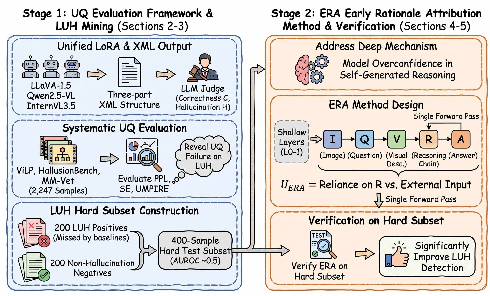

**图 1.1：本文两阶段研究路线与技术流程图。**

两个阶段分别承担以下任务：

1. **实验一：UQ 评估与 LUH 盲区识别（第 2—3 章）。** 建立统一的正确性与幻觉评估框架，系统考察现有 UQ 方法对幻觉的检测能力，识别稳定的低不确定性漏检区域，并据此构建后续研究所需的困难子集。

2. **实验二：新不确定性信号的探索与验证（第 4—5 章）。** 面向实验一揭示的检测盲区，从模型推理早期对视觉证据的依赖关系中探索新的不确定性信号，并在困难子集上验证其识别能力与跨模型有效性。


---

## 2 实验一：UQ评估框架设计

### 2.1 评测模型与数据集

#### 2.1.1 评测模型与 LoRA 格式微调

**评测模型与本地部署。** 本实验评测三个开源多模态大模型（表 2.1）：LLaVA-1.5-7B [26]、Qwen2.5-VL-7B-Instruct [27] 与 InternVL3.5-8B [28]，分别覆盖经典视觉投影架构、原生动态分辨率架构以及高分辨率视觉编码与语言模型组合架构。三个模型均采用本地离线部署：vLLM 负责批量生成并保存精确 token，Transformers 对相同 token 做 teacher forcing 回放，提取 UQ 所需概率与最后一层隐藏状态。

**表 2.1：三个评测模型。**

| 模型（Hugging Face） | 参数量 | 架构特点 |
|---|---:|---|
| LLaVA-1.5-7B [26]（`llava-hf/llava-1.5-7b-hf`） | 约 7B | CLIP ViT-L/14@336 + 线性投影 + LLaMA 系语言主干 |
| Qwen2.5-VL-7B-Instruct [27]（`Qwen/Qwen2.5-VL-7B-Instruct`） | 约 7B | 动态分辨率视觉编码器 + Qwen2.5 语言主干的原生多模态架构 |
| InternVL3.5-8B [28]（`OpenGVLab/InternVL3_5-8B`） | 约 8B | InternViT@448 + 视觉 token 下采样投影 + Qwen3 语言主干 |

**LoRA 格式微调。** 为使 Judge 与 UQ 方法能够稳定区分视觉证据、推理过程和最终答案，三个模型分别进行轻量级格式微调，将回答统一为 `<vision>视觉观察</vision><reasoning>推理过程</reasoning><answer>最终答案</answer>`。LoRA [32] 仅更新语言模型注意力层中的少量低秩参数，视觉编码器、多模态投影层及其余基础参数均保持冻结，从而尽量保留模型原有的视觉感知、图文对齐和回答能力；具体训练设置见附录 A.3，其对正确率与幻觉率的影响通过附录 A.4 的配对消融进一步检验。

**表 2.2：三模型格式 LoRA 的共同训练配置。**

| 配置项 | 取值 |
|---|---|
| 训练数据 | VQAv2 [31] train2014 构造，4,000 训练 / 1,000 验证 |
| LoRA rank / alpha / dropout | 8 / 16 / 0.05 |
| 目标模块 | 语言模型 `q_proj`、`v_proj` |
| 学习率 / 训练轮数 | 2×10⁻⁴ / 1 |
| 验证 loss | 0.765（LLaVA）/ 0.693（Qwen）/ 0.657（InternVL） |

**回答示例。**

> 问题：Modern drones typically have four propellers. How many propellers does the drone in the picture have?
>
> 回答：`<vision>The image shows a large drone hovering over a futuristic cityscape. The drone has a central body with four distinct propellers, each attached to a rotor arm extending outward.</vision><reasoning>The drone in the picture clearly has four propellers, which is the standard configuration for modern drones.</reasoning><answer>4</answer>`


#### 2.1.2 评测数据集

三个数据集均使用 Hugging Face 发布的完整评测数据[^1]，样本数按实际送入模型的"问题实例"计数（表 2.3）。三个数据集共 2,247 个问题实例，三个模型在完全相同的问题清单上评测，共得到 6,741 个"问题—模型"主回答实例。

[^1]: ViLP: https://huggingface.co/datasets/ViLP/ViLP ；HallusionBench: https://huggingface.co/datasets/lmms-lab/HallusionBench ；MM-Vet: https://huggingface.co/datasets/lmms-lab/MMVet 。

**表 2.3：评测数据集概览。**

| 数据集 | 问题实例数 | 数据与任务类型 | 答案类型 |
|---|---:|---|---|
| ViLP [29] | 900 | 300 个问题 × 3 组图像—答案（QIA） | 开放式 |
| HallusionBench [9] | 1,129 | 951 个图像问题 + 178 个非图像问题 | 选择式（是 / 否） |
| MM-Vet [30] | 218 | 单图视觉问答，六类核心能力 | 开放式 |

三个数据集详细信息见附录 A.1。

### 2.2 回答生成与标注

#### 2.2.1 回答生成协议

被测模型统一采用固定单行 XML 协议回答：

```text
<vision>Relevant visual evidence.</vision><reasoning>Brief reasoning based on the evidence.</reasoning><answer>Concise final answer.</answer>
```

回答指令、图像与问题放在同一条 user message 中，不创建 system message。每个输入生成两条流水线：

- **greedy 主回答**：`do_sample=false`，用于正确性/幻觉标注与 Perplexity 计算；
- **K=10 随机采样回答**：`do_sample=true, temperature=1.0`，每条采样回答最多进行 50 次 XML 格式拒绝重采样，供 Semantic Entropy 与 UMPIRE 使用。

同一批采样回答同时供 Semantic Entropy 与 UMPIRE 使用，避免采样差异。生成时记录最终回答 token 的逐 token log probability 与最后一层隐藏状态（用于 UMPIRE），回答中XML标签错误的样本在数据清洗中会被排除，最终的有效样本统计见附录 B.4。

#### 2.2.2 正确性与幻觉的独立标注

每条 greedy 主回答分别交由 GPT-5.6-Terra 与 Gemini-3.7-Flash 两个多模态 LLM Judge 独立评判。二者接收完全相同的原图、问题、参考答案、模型回答和统一 Judge Prompt，评判过程中互不可见对方的输出。每个 Judge 在同一次调用中分别给出两个相互独立的字段：

1. **正确性 \(C\)**：只比较 `<answer>` 与数据集参考答案的语义一致性；
2. **幻觉 \(H\)**：只评价 `<vision>` 与 `<reasoning>` 是否包含图像、问题、上下文或可验证事实不支持的内容，按 0–6 量表打分，`rating < 3` 判为存在幻觉，并给出 `vision_hallucination` / `reasoning_hallucination` 类型。

两个 Judge 完成后，程序按字段分别比较 `correct` 与 `hallucination`。若某一字段一致，则直接采用双 Judge 共识；若某一字段不一致，则仅将该冲突字段送入人工盲裁。人工界面只展示原图、问题、参考答案、候选回答及需要裁决的字段，不展示两个 Judge 各自的标签和身份，以降低锚定效应；人工裁判给出最终二值标签，若判为幻觉，还需确定视觉幻觉、推理幻觉或两者兼有。

正式字段标签由下式确定：

\[
\widehat y_{i,f}=
\begin{cases}
y^{\mathrm{GPT}}_{i,f}=y^{\mathrm{Gemini}}_{i,f}, & \text{两个 Judge 在字段 }f\text{ 上一致},\\
y^{\mathrm{Human}}_{i,f}, & \text{两个 Judge 在字段 }f\text{ 上不一致},
\end{cases}
\qquad f\in\{C,H\}.
\]

Judge 的评分指令与输出格式见附录 A.2。两个 Judge 在 6,667 条有效样本上的正确性 agreement rate 为 97.60%（Cohen's $\kappa=0.950$），幻觉 agreement rate 为 86.53%（$\kappa=0.725$）；160 个正确性字段与 898 个幻觉字段进入人工裁决，其中 45 条样本两个字段同时冲突，共涉及 1,013 条唯一样本。模型级一致性与人工仲裁明细见附录 B.5。该协议既保留正确性与幻觉的独立性，也避免将任一单一 LLM Judge 的结果直接视为正式标签，使后续 UQ 评估能够分别研究错误检测与幻觉检测。

### 2.3 基线方法与评估指标

#### 2.3.1 三种基线 UQ 方法

三种方法均规定"分数越高，不确定性越高"，正式检测对象统一为最终答案部分的内容。

**Perplexity。** PPL 是语言模型中常用的序列概率不确定性度量，通过模型对已生成答案的条件概率衡量预测的不确定性。给定图文问题及提示组成的条件输入 \(q\)，设最终答案部分的 token 序列为 \(y=(w_1,\ldots,w_N)\)，自回归模型给出的序列概率为
\[
p_M(y\mid q)=\prod_{j=1}^{N}p_M(w_j\mid q,w_{<j}),
\]

其长度归一化负对数似然与困惑度分别为

\[
\operatorname{NLL}(y\mid q)=-\frac{1}{N}\sum_{j=1}^{N}\log p_M(w_j\mid q,w_{<j}),
\qquad
\operatorname{PPL}(y\mid q)=\exp\!\left(\operatorname{NLL}(y\mid q)\right).
\]

PPL 是 token 层面的局部不确定性：若模型在给定前缀下普遍只赋予实际答案 token 较低概率，则 PPL 较高。它不比较多次生成的语义是否一致，因此构成本实验的单回答概率基线。

**Semantic Entropy。** SE 将不确定性定义在"回答含义"而非表面 token 序列上，避免把同义表述误判为相互矛盾的答案。从 \(p_M(\cdot\mid q)\) 采样 \(K=10\) 条最终答案 \(y_1,\ldots,y_K\)，按**相对于问题上下文的双向蕴含**关系将它们划分为语义簇 \(\mathcal C=\{c_1,\ldots,c_m\}\)：仅当 \(y_a\) 蕴含 \(y_b\) 且 \(y_b\) 蕴含 \(y_a\) 时，二者才归入同一簇。为减弱回答长度对有限样本概率质量的直接支配，先计算每条采样答案的长度归一化 log probability，再以 softmax 归一化作为其概率质量：

\[
\ell_i=\frac{1}{|y_i|}\sum_j\log p_M(w_{i,j}\mid q,w_{i,<j}),
\qquad
\tilde p_i=\frac{\exp(\ell_i)}{\sum_k\exp(\ell_k)},
\]

簇概率与语义熵为

\[
p(c)=\sum_{i:y_i\in c}\tilde p_i,
\qquad
\widehat{\operatorname{SE}}(q)=-\sum_{c\in\mathcal C}p(c)\log p(c).
\]

当采样回答集中于一个或少数几个语义簇时，SE 低；当模型在多个彼此不同的答案含义之间分散时，SE 高。该熵以归一化概率质量而非簇内采样次数计算，避免回答长度对有限样本概率估计的直接影响。

NLI 语义判别采用 `DeBERTa-v3-large`，详细配置见附录 A.2.4。

**UMPIRE。** UMPIRE（*Uncertainty using Model Probability Indicators and Response Embeddings*）把两类信号合并为一个训练无关的多模态不确定性分数：采样回答在模型内部语义/多模态表征空间中是否分散，以及模型对每个回答在给定图文输入下的条件概率是否低。对同一输入 \(q\) 的 \(K\) 条采样最终答案 \(y_i\)，令 \(\phi_i\in\mathbb{R}^d\) 为被测 MLLM 最后一层在最终回答 token 处提取并 \(\ell_2\) 归一化后的回答表征，\(\Phi=[\phi_1^\top;\ldots;\phi_K^\top]\in\mathbb{R}^{K\times d}\)。回答的模型条件概率及其不一致度定义为

\[
p_i=p_M(y_i\mid q)=\prod_{j=1}^{|y_i|}p_M(w_{i,j}\mid q,w_{i,<j}),
\qquad
c_i=\exp\!\bigl(\alpha(1-p_i)\bigr),
\]

其中 \(\alpha\geq0\) 控制不一致度项的权重；\(p_i\) 越低，表示该回答越不受模型自身给定的全部输入模态支持，因而 \(c_i\) 越大。令 \(C=\operatorname{diag}(c_1,\ldots,c_K)\)、\(\epsilon>0\) 为保证数值非退化的微小常数，则 UMPIRE 的不确定性为

\[
\operatorname{UMPIRE}(q)=\frac{1}{2K}\log\det\!\left[C\left(\Phi\Phi^\top+\epsilon I_K\right)C\right],
\]

该式可分解为语义体积项 \(\frac{1}{2K}\log\det(\Phi\Phi^\top+\epsilon I_K)\) 与平均不一致度项 \(\frac{\alpha}{K}\sum_i(1-p_i)\)，分别对应回答表征张成的平方体积与平均不一致度。因此 UMPIRE 同时对"模型给出多种相距较远的答案"以及"回答变化不大但模型对这些回答普遍缺乏内部支持"给出高分；后者是仅依赖回答间语义离散度的方法可能漏检的情形。

#### 2.3.2 评估指标

所有指标在每个“模型 × 数据集”单元格内独立计算，不跨模型或数据集比较原始分数。

**标签基础。** 正确性标签 \(C_i\) 与幻觉标签 \(H_i\) 的总体水平由两个比率刻画：

\[
\mathrm{Accuracy}=\frac{1}{N}\sum_{i=1}^{N}C_i,\qquad
\mathrm{Hallucination\ Rate}=\frac{1}{N}\sum_{i=1}^{N}H_i,
\]

其中 \(N\) 为单元格内有效样本数。Accuracy 描述最终答案与参考答案一致的比例，Hallucination Rate 描述视觉观察或推理中含无依据内容的样本比例。由于 \(C\) 与 \(H\) 独立，二者并不互补：正确样本中可能含幻觉，错误样本中也可能无幻觉。

**排序能力。** 为评估 UQ 分数能否区分正负样本（以错误 \(E=1-C\) 或幻觉 \(H\) 为正类），使用三个指标。给定分数 \(s_i\) 与二值标签 \(y_i\)：

- **AUROC（Area Under the Receiver Operating Characteristic Curve，ROC 曲线下面积）**。将样本按分数降序排列，以每个分数为阈值计算真正例率（TPR）与假正例率（FPR），ROC 曲线为 FPR–TPR 的关系曲线，AUROC 为其面积。等价地，AUROC 等于随机取一个正样本与一个负样本时，正样本分数高于负样本的概率。

- **AUPRC（Area Under the Precision-Recall Curve，PR 曲线下面积）**。以每个分数为阈值计算查准率（Precision）与召回率（Recall），PR 曲线为 Recall–Precision 的关系曲线，AUPRC 为其面积，等价于平均查准率（Average Precision）。与 AUROC 不同，AUPRC 对正类比例敏感：正类越稀有，随机基准的 AUPRC 越低。

- **PRR（Prediction Rejection Ratio，预测拒绝比）**。衡量按分数从高到低“拒绝”（即人为不信任）一部分样本后，剩余样本精度的提升幅度。定义 retained-precision 曲线为拒绝比例 \(r\) 下剩余样本的正类比例，其曲线下面积为 \(A\)；随机排序的面积为 \(A_{\mathrm{rand}}=1-p_+\)（\(p_+\) 为正类比例），oracle 排序（按标签降序）的面积为 \(A_{\mathrm{oracle}}\)，则
\[
\mathrm{PRR}=\frac{A-A_{\mathrm{rand}}}{A_{\mathrm{oracle}}-A_{\mathrm{rand}}}.
\]
PRR 取值 0 表示与随机排序无异，1 表示达到 oracle 排序；它回答了“若只信任分数最高的样本，能多准确地保留正类”这一实际部署问题。

实验一的完整评估流程如图 2.1 所示。

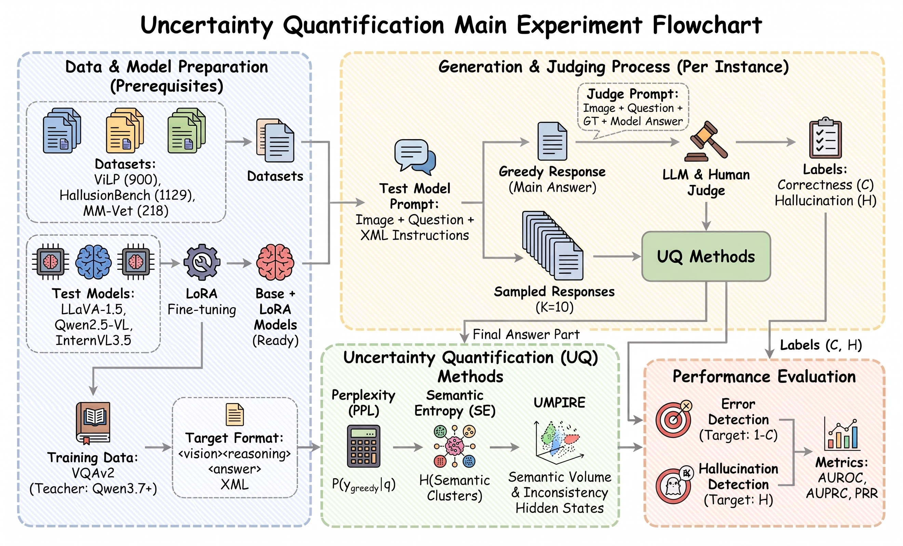

**图 2.1：实验一不确定性方法评估流程，涵盖数据与模型准备、回答生成与标注、不确定性量化和性能评估。**

## 3 实验一：评估结果分析与低不确定性子集提取

### 3.1 描述性统计

#### 3.1.1 准确率与幻觉率

三个模型在全部数据上共生成 6,741 条回答，其中 6,667 条满足 XML 格式要求并进入正式评估，有效率达到 98.9%；各模型与数据集的 XML 排除明细见附录 B.4。这表明格式适配能够较稳定地支持后续正确性、幻觉与不确定性分析。不同模型间表现存在明显差异：LLaVA 的总体准确率最低（0.493）且幻觉率最高（0.679），而 Qwen 与 InternVL 在准确率提升的同时具有明显更低的幻觉率，分别为 0.358 和 0.322，其中 InternVL 的总体表现最好。

**表 3.1.1：各“模型 × 数据集”单元格的准确率与幻觉率。**

| 模型 × 数据集 | n | Accuracy | Hallucination Rate |
|---|---:|---:|---:|
| llava / vilp | 886 | 0.529 | 0.527 |
| llava / hallusionbench | 1,108 | 0.514 | 0.795 |
| llava / mmvet | 216 | 0.241 | 0.704 |
| qwen / vilp | 898 | 0.647 | 0.239 |
| qwen / hallusionbench | 1,099 | 0.661 | 0.468 |
| qwen / mmvet | 218 | 0.560 | 0.298 |
| internvl / vilp | 900 | 0.618 | 0.254 |
| internvl / hallusionbench | 1,126 | 0.710 | 0.386 |
| internvl / mmvet | 216 | 0.551 | 0.264 |
| llava 合计 | 2,210 | 0.493 | 0.679 |
| qwen 合计 | 2,215 | 0.645 | 0.358 |
| internvl 合计 | 2,242 | 0.658 | 0.322 |
| 总体 | 6,667 | 0.599 | 0.452 |

从数据集维度看，HallusionBench 对模型的幻觉控制提出了更高要求。例如 LLaVA 在该数据集上的准确率仍超过 0.5，但幻觉率达到 0.795；Qwen 与 InternVL 虽显著降低了幻觉率，仍分别达到 0.468 和 0.386。相比之下，ViLP 上 Qwen 与 InternVL 的幻觉率均约为 0.25。该现象表明，模型最终答案能力与生成内容的事实可靠性虽总体相关，却并不存在简单的一一对应关系；单纯依赖准确率不足以完整反映多模态模型的可信性。

#### 3.1.2 正确性与幻觉的联合分布

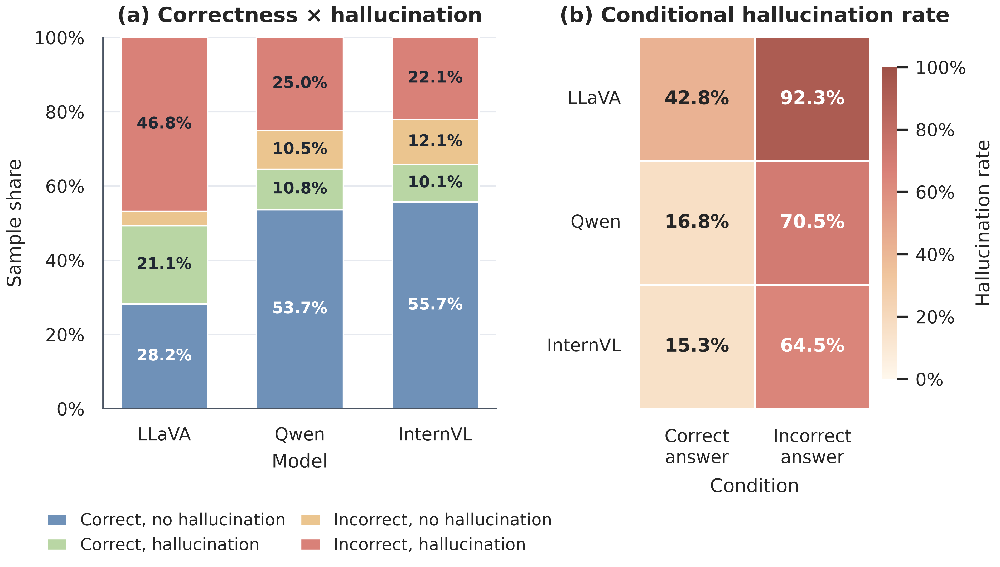

**图 3.1.2a：左图为各模型正确性与幻觉标签的 100% 堆叠分布，右图为答案正确和错误条件下的幻觉率热力图。**

如图 3.1.2a 所示，正确性与幻觉标签的联合统计进一步验证了二者并非同一评价目标。在全部 6,667 条有效回答中，14.0% 的样本属于“答案正确但含幻觉”，另有 8.8% 属于“答案错误但无幻觉”。若直接使用错误标签 \(E=1-C\) 代替幻觉标签，将造成 1,522 条样本错配（590 + 932），占全部样本的 22.8%。此外，全部幻觉回答中有 30.9%（932/3,015）的最终答案仍然正确，而全部错误回答中有 22.1%（590/2,673）并不存在幻觉；对应的完整计数与条件比例见附录 B.1。

因此，答案错误可以视为幻觉的重要伴随现象，但不能作为幻觉的充分或必要条件。九个“模型 × 数据集”单元格中的绝对 \(\phi\) 系数仅为 0.46–0.65，也说明二者虽具有中等至较强关联，却远未达到等价关系。

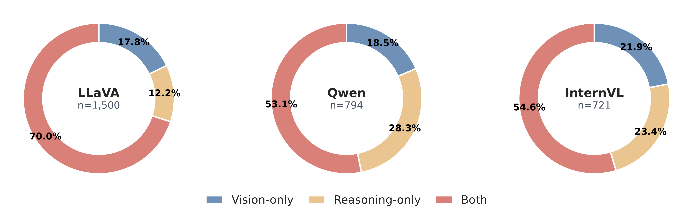

**图 3.1.2b：三个模型幻觉样本中的纯视觉型、纯推理型与双重型构成（并列环形图）。**

如图 3.1.2b 所示，进一步观察幻觉类型发现，61.9% 的幻觉同时出现在视觉观察与推理阶段，而纯视觉型和纯推理型分别占 19.0% 和 19.1%；各模型的完整计数与比例见附录 B.1。这说明幻觉通常并非局限于最终答案，而会沿着“视觉表征—推理—答案”的生成链条传播。因此，有必要使用独立幻觉标签评价 UQ 方法，不能继续以最终答案正误作为代理目标。

## 3.2 错误与幻觉检测性能

### 3.2.1 错误检测性能

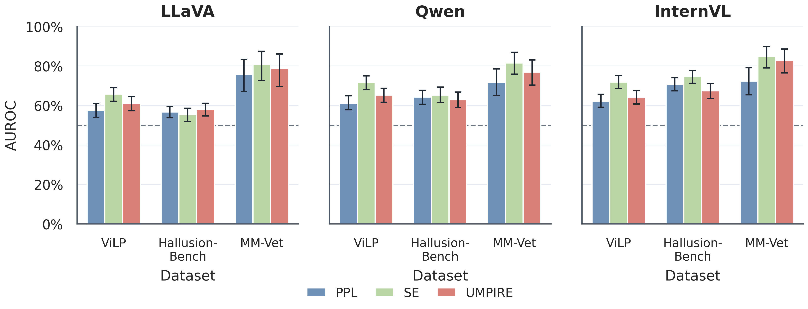

**图 3.2.1：三种 UQ 方法在各模型与数据集上的错误检测 AUROC。误差线表示 95% bootstrap 置信区间，虚线表示随机水平（0.5）。**

如图 3.2.1 所示，以答案错误为目标时，Semantic Entropy 在九个“模型 × 数据集”单元格中有八个取得最优 AUROC，九格均值达到 0.724；完整 AUROC 与置信区间见附录 B.2。UMPIRE 仅在 LLaVA/HallusionBench 取得最优，PPL 没有最优单元格。按平均排名计，SE、UMPIRE 和 PPL 分别为 1.22、2.11 和 2.67。每模型宏平均的 SE AUROC 也始终最高（LLaVA/Qwen/InternVL 分别为 0.672/0.729/0.771），说明多次采样得到的语义分散度对于最终答案错误具有较稳定的排序能力。MM-Vet 上三种方法的 AUROC 也普遍高于 ViLP 与 HallusionBench，表明开放式视觉问答、OCR 和数学等复合任务中的答案错误通常伴随更明显的生成不稳定性。

### 3.2.2 幻觉检测性能

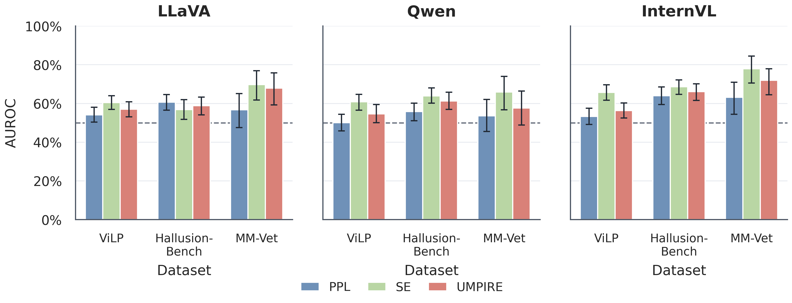

**图 3.2.2：三种 UQ 方法在各模型与数据集上的幻觉检测 AUROC。误差线表示 95% bootstrap 置信区间，虚线表示随机水平（0.5）。**

如图 3.2.2 所示，将目标改为幻觉后，三种方法的排序性能整体下降：PPL、SE 和 UMPIRE 的九格均值分别由错误检测时的 0.658、0.724 和 0.685 降至 0.568、0.655 和 0.613，完整 AUROC 与置信区间见附录 B.3。SE 在八个单元格中取得最高 AUROC，仅 LLaVA/HallusionBench 由 UMPIRE 略高；但其绝对性能已经明显弱于错误检测。PPL 的四个单元格置信区间覆盖随机水平 0.5，UMPIRE 有一个单元格覆盖 0.5，而 SE 的九个置信区间均不覆盖 0.5。每模型宏平均的 SE AUROC 为 0.623/0.636/0.707，低于其对应的错误检测结果。这说明采样语义分散度更容易捕捉“答案不稳定”，却不能充分识别视觉观察和推理中的事实性幻觉。

### 3.2.3 检测性能差距

**表 3.2.3a：各模型在三个数据集上的平均 AUROC(H) − AUROC(E) 差距（负值表示幻觉检测弱于错误检测）。**

| 模型 | PPL | SE | UMPIRE |
|---|---:|---:|---:|
| LLaVA | −0.061 | −0.049 | −0.045 |
| Qwen | −0.126 | −0.093 | −0.105 |
| InternVL | −0.083 | −0.063 | −0.066 |

如表 3.2.3a 所示，对每个“模型 × UQ 方法”在三个数据集上的差距取平均后，九个平均值均为负，全部组合的总体均值为 −0.077。Qwen 在三种方法上的平均降幅最大，LLaVA 的平均降幅相对较小，InternVL 位于二者之间。因此，幻觉检测弱于错误检测是跨模型、跨方法的总体趋势；各数据集单元格的完整差距与 95% bootstrap 置信区间见附录 B.3.1。

进一步只在错误样本内部区分“错误且幻觉”和“错误但无幻觉”，三种方法的九格均值 AUROC 分别为 PPL 0.400、SE 0.494 和 UMPIRE 0.423，27 个组合中有 22 个低于 0.5。最低值为 UMPIRE/LLaVA-HallusionBench 的 0.307。这表明即使模型已经答错，现有 UQ 分数也难以判断错误是否伴随事实性幻觉，进一步说明独立的幻觉标签不可由错误标签替代。

## 3.3 低不确定性幻觉盲区

LUH 规模量化按模型合并三个数据集，并对每种 UQ 方法分别以非幻觉样本分数分布的第 \(\alpha\) 分位数为阈值：

\[
\mathrm{LUH\_share}(\alpha)
=
P\!\left(s_{H=1}\le Q_{\alpha}(s_{H=0})\right),
\qquad \alpha\in\{0.25,0.50\}.
\]

其中 \(Q_{\alpha}(s_{H=0})\) 只由非幻觉样本确定，位于阈值处的并列样本全部纳入。\(\alpha=0.25\) 刻画较严格的下四分位盲区，\(\alpha=0.50\) 刻画更宽松的中位数盲区。

### 3.3.1 盲区统计与漏检规模

**表 3.3.1：两个分位阈值下的 LUH 比例与绝对数量。**

| 模型 | 幻觉总数 | 方法 | \(\alpha=0.25\) 比例 | \(\alpha=0.25\) 数量 | \(\alpha=0.50\) 比例 | \(\alpha=0.50\) 数量 |
|---|---:|---|---:|---:|---:|---:|
| LLaVA | 1,500 | PPL | 0.195 | 292 | 0.434 | 651 |
| LLaVA | 1,500 | SE | 0.137 | 206 | 0.453 | 680 |
| LLaVA | 1,500 | UMPIRE | 0.169 | 254 | 0.397 | 595 |
| Qwen | 794 | PPL | 0.246 | 195 | 0.515 | 409 |
| Qwen | 794 | SE | 0.236 | 187 | 0.301 | 239 |
| Qwen | 794 | UMPIRE | 0.164 | 130 | 0.385 | 306 |
| InternVL | 721 | PPL | 0.166 | 120 | 0.449 | 324 |
| InternVL | 721 | SE | 0.158 | 114 | 0.268 | 193 |
| InternVL | 721 | UMPIRE | 0.062 | 45 | 0.312 | 225 |

如表 3.3.1 所示，在 \(\alpha=0.25\) 时，LUH 比例为 0.062–0.246，对应 45–292 条漏检样本；阈值放宽到 \(\alpha=0.50\) 后，LUH 比例增至 0.268–0.515，对应规模扩大到 193–680 条。除 Qwen/PPL 的中位数阈值结果略高于交换性基准 0.50 外，其余组合均低于对应的 \(\alpha\)，说明这些 UQ 方法总体上具有排序能力，但在严格与宽松阈值下仍会遗漏数量可观的幻觉样本。表中每一行均为特定模型与方法独立定义的 LUH 子集，不同方法的子集可能重叠，因此不能跨方法直接相加。

### 3.3.2 失效归因

基于上述 LUH 划分进行失效归因后，PPL、SE 和 UMPIRE 三种 UQ 方法呈现出明确且不同的结构性特征。

- **PPL 的失效与答案形式和长度有关。** PPL 所遗漏的 LUH 回答通常更短，常见形式为 Yes/No、数字或不超过 3 个词，且 PPL 均值接近 1.000。幻觉样本内答案 token 数与 PPL 的 Spearman 相关在 LLaVA、Qwen、InternVL 中分别为 0.122、0.187 和 0.389，说明长度归一化和短答案的概率地板会使模型以极高概率输出错误答案。
- **SE 的失效表现为语义簇塌缩。** SE 所遗漏的 LUH 样本通常只有一个主导语义簇，主导簇质量接近 1，SE 接近 0。换言之，SE 能识别回答含义不稳定，却无法识别模型稳定重复的同一幻觉。
- **UMPIRE 的失效表现为表征和概率同时自洽。** UMPIRE 所遗漏的 LUH 样本具有更低的语义体积，平均不一致度接近 0；这说明模型内部表征与生成概率都在支持同一个错误答案，但没有额外的外部证据约束来纠正它。

综合而言，低不确定性幻觉不是单一的随机噪声，而是“短答案高概率”“语义簇稳定”和“内部表征一致”共同造成的系统性漏检。这为后续困难子集的构建提供了依据：必须同时控制 PPL、SE 和 UMPIRE 三种 UQ 方法的分数差异，才能检验新方法是否真正利用了这些基线之外的信息。

## 3.4 典型案例分析

本节给出三个典型案例，分别展示语言先验凌驾视觉证据、视觉读数错误以及“答案正确但中间观察含幻觉”三种情形。

**案例 1（LLaVA / ViLP，语言先验凌驾视觉证据）。** 问题句首给出"袋鼠以跳跃著称"的先验信息，图像实际是考拉：

**表 3.4.1：案例 1 样本信息与模型回答。**

| 字段 | 内容 |
|---|---|
| 样本 | ViLP row 55, case 2 |
| 问题 | The kangaroo is known for its excellent jumping. Which animal native to Australia is shown in the image demonstrating a jump? |
| 参考答案 | Koala |
| 模型回答 | `<vision>` The image shows a large animal with a long tail, large paws, and a distinctive coat pattern leaping into the air. The animal's body is positioned horizontally, with its legs extended and its head raised. The animal's face is clearly visible, showing a distinctive muzzle and large eyes. `</vision>` → `<reasoning>` The animal in the image is a kangaroo, which is a native Australian mammal known for its excellent jumping abilities. `</reasoning>` → `<answer>` kangaroo |
| Judge | rating 1，`vision_hallucination` + `reasoning_hallucination`（将考拉误认为袋鼠，并编造"长尾"等与图像不符的特征） |


模型受问题中“kangaroo is known for jumping”的语言先验影响，将图中的考拉误认为袋鼠，并进一步编造了长尾等不存在的视觉特征。该案例表明，问题中的先验暗示可能压过实际图像证据，导致观察与推理同时出现幻觉。

**案例 2（Qwen / MM-Vet，视觉读数错误）。** 问题询问汽油单价，模型把显示屏上的总金额误读为单价：

**表 3.4.2：案例 2 样本信息与模型回答。**

| 字段 | 内容 |
|---|---|
| 样本 | MM-Vet v1_16（capability: ocr, math） |
| 问题 | What is the gasoline price? |
| 参考答案 | 4.299（≈4.3） |
| 模型回答 | `<vision>` The image shows a digital display on a gas pump. At the top, the text 'This Sale' is visible. Below that, the price is shown as '62.85', and underneath the price, the number of gallons dispensed is '4.620'. At the bottom of the display, the word 'Gallons' is written. `</vision>` → `<reasoning>` The price of the gasoline is clearly displayed at the top of the digital screen as '62.85'. `</reasoning>` → `<answer>` 62.85 |
| Judge | rating 1，`vision_hallucination` + `reasoning_hallucination`（62.85 是销售总金额，单价约 4.299 美元/加仑；同时将 14.620 加仑误读为 4.620） |


模型将加油机上的销售总金额 62.85 误读为汽油单价，同时将 14.620 加仑误读为 4.620 加仑，随后又在推理中将错误读数表述为“clearly displayed”。该案例表明，局部 OCR 或数值读取错误会沿推理链传播，最终形成表述确定但与图像不符的答案。

**案例 3（InternVL / HallusionBench，答案正确但视觉观察含幻觉）。** 问题询问苹果公司 2012–2022 年收入是否主要来自日本，模型答"否"（正确），但其视觉观察包含不实陈述：

**表 3.4.3：案例 3 样本信息与模型回答。**

| 字段 | 内容 |
|---|---|
| 样本 | HallusionBench image, VS / chart, set 6, figure 1, question 3 |
| 问题 | From 2012 to 2022, did Apple derive the majority of its revenue from Japan? |
| 参考答案 | No |
| 模型回答 | `<vision>` The stacked area chart shows the share of total revenue for Apple from 2012 to 2022, divided by region. The 'Japan' region is represented by a red layer, which is consistently the smallest segment throughout the entire period. `</vision>` → `<reasoning>` Since the red layer representing Japan is the smallest and never exceeds 10% of the total revenue, it is clear that Apple did not derive the majority of its revenue from Japan. `</reasoning>` → `<answer>` no |
| Judge | rating 2，`vision_hallucination`（亚太其他地区在多个时期比日本更小，"日本始终最小"的观察不准确）；**correct=true** |

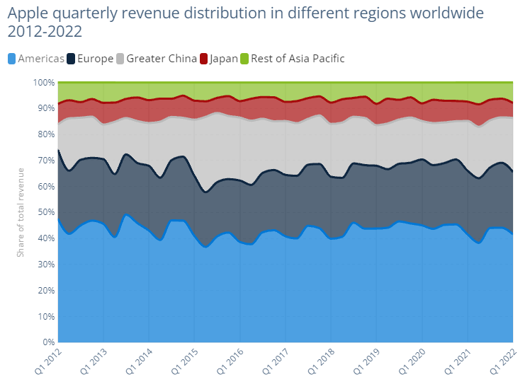

模型的最终答案“no”是正确的，但中间视觉观察错误地声称日本在整个时期始终是最小的收入来源。该案例表明，最终答案正确不代表中间视觉陈述也完全可靠，因此正确性与幻觉需要分别标注和评估。

三个案例分别对应先验误导、视觉读数错误和正确答案中夹带错误观察。它们共同说明，仅检查最终答案不足以判断整个回答是否有充分的视觉证据支持，还需同时审查视觉观察与推理过程。结合 3.3.2 节的归因结果，短答案或数字答案的高 token 概率使 PPL 偏低，错误结论在多次采样中稳定重复使 SE 偏低，而内部表征与生成概率对同一结论的自洽支持，则使 UMPIRE 难以识别其中缺乏视觉证据的内容。

## 3.5 低不确定性困难子集

### 3.5.1 困难子集构建流程

困难子集用于构造“三种 UQ 方法给出相近分数，但幻觉标签相反”的正负样本。具体流程如下。

**Step 1：候选池筛选。** 按 Judge 标签有效、PPL、SE 和 UMPIRE 分数均有效、幻觉标签非空且包含图像输入的条件，为每个模型建立候选池。

**Step 2：分数百分位转换。** 在每个“模型 × 数据集”单元格内，分别将三种 UQ 分数转换为百分位，并计算平均百分位 \(\bar p=\frac{1}{3}(p_{\mathrm{PPL}}+p_{\mathrm{SE}}+p_{\mathrm{UMPIRE}})\)。

**Step 3：LUH 正类提取。** 在每个模型内合并三个数据集，选取 \(\bar p\) 最低的 200 条幻觉样本作为 LUH 正类。

**Step 4：非幻觉负类匹配。** 以三种 UQ 方法的分数百分位作为匹配特征，在同一模型的非幻觉池中按欧氏距离进行不放回的贪心一对一最近邻匹配，得到 200 条负类。匹配按正类 \(\bar p\) 从低到高依次进行。

**Step 5：完整性复核。** 复核正负类标签、图像输入和样本数量，最终每个模型得到 200 条 LUH 正类与 200 条匹配非幻觉负类。

候选池规模、正负类分数对齐、配对距离及最终子集组成见附录 B.3.2。

### 3.5.2 基线性能

**表 3.5.2：基线在困难子集上的检测性能（正类 = LUH，负类 = 匹配非幻觉；AUROC / AUPRC）。**

| 模型 | PPL | SE | UMPIRE |
|---|---|---|---|
| LLaVA | **0.402** / 0.435 | 0.476 / 0.464 | **0.413** / 0.437 |
| Qwen | 0.485 / 0.499 | 0.499 / 0.496 | 0.477 / 0.489 |
| InternVL | 0.489 / 0.498 | 0.498 / 0.500 | 0.502 / 0.502 |

九个“模型 × 方法”组合的 AUROC 范围为 0.402–0.502，均值为 0.471，其中 8/9 低于随机水平 0.5。LLaVA 的 PPL 和 UMPIRE 置信区间上界均低于 0.5，表现为稳定的轻微反排序；Qwen 与 InternVL 的分数虽接近随机，但置信区间大多覆盖 0.5。由此可见，在三种 UQ 方法的分数分布得到匹配后，PPL、SE 和 UMPIRE 均无法可靠区分 LUH 与非幻觉样本，这一困难子集可以作为实验二评价 ERA 的严格基线。

综上，实验一形成了从标签关系、检测性能到失效样本的递进证据。首先，正确性与幻觉虽然相关，但存在不可忽略的标签错配，因此不能以答案错误替代幻觉标签。其次，PPL、SE 和 UMPIRE 对答案错误具有一定的排序能力，但对幻觉的检测性能整体更弱，且均会漏检一部分低不确定性幻觉。进一步地，在困难子集中显式对齐三种 UQ 方法的分数分布后，其 AUROC 均接近随机水平，说明生成概率、采样语义一致性和内部表征自洽性均不能保证回答获得了充分的视觉证据支持。这些结果将实验二的研究重点从“模型对答案有多确定”转向“这种确定性是否真正来源于图像与问题等外部证据”，并由此引出对推理早期跨模态归因信号的建模。

## 4 实验二：ERA 早期推理归因不确定性量化方法设计

### 4.1 方法动机

实验一表明，Perplexity、Semantic Entropy 和 UMPIRE 等现有不确定性量化方法虽然能够在总体数据上一定程度地区分正确与错误回答，但在低不确定性幻觉（Low-Uncertainty Hallucination，LUH）样本上存在明显失效。尤其在构造的低不确定性困难子集中，幻觉正样本与非幻觉负样本在三种基线 UQ 分数空间中被显式匹配，其 AUROC 处于随机水平附近或呈轻微反排序。这说明，仅依赖生成概率、重复采样一致性或最终隐藏表示的稳定程度，难以识别模型“稳定地产生错误内容”的情况。

这一现象的根本原因在于，传统 UQ 方法主要回答的是：

> **模型是否稳定地相信当前回答？**

而 LUH 所暴露的问题是，即使模型对一个回答具有很高的生成置信度，该回答仍可能缺少来自输入图像和问题的真实证据支持。换言之，**预测稳定性并不等价于证据充分性** [23]。

基于这一观察，实验二不再继续从输出概率分布寻找额外的不确定性信号，而是转向最终答案形成过程中的**信息来源结构**。对于本文经过 LoRA 微调得到的结构化回答

`<vision>`\(V\)`</vision><reasoning>`\(R\)`</reasoning><answer>`\(A\)`</answer>`

模型在生成最终答案 \(A\) 时可以利用两类性质不同的信息。一类是图像 \(I\) 和问题文本 \(Q\)，它们来自模型外部，可以视为当前问题的外部证据；另一类是模型先前自行生成的视觉描述 \(V\) 和推理过程 \(R\)，它们已经经过模型内部加工，可能包含此前产生的错误感知或错误推理 [22]。

因此，本文提出 **ERA（Early Rationale Attribution，早期推理归因）**，其基本假设为：

> **模型对回答越自信，生成答案时就越依赖自己已生成的视觉描述与推理，而越少参照图像与问题；这种向内依赖在答案形成的早期（浅层）即已显现，前序错误因此被自我强化，最终表现为低不确定性幻觉。**

由此，ERA 不直接测量“答案有多不稳定”，而是测量**答案决策在自身生成内容与外部证据之间的依赖偏向**。这一量可以视为一种面向证据来源的结构性不确定性。

### 4.2 五类语义区域划分

为了刻画最终答案的信息来源，ERA 将一次完整前向传播中的 token 按语义来源划分为五个区域：

| 区域 | 符号 | 内容 | 属性 |
|---|:---:|---|---|
| 图像证据 | \(I\) | 图像对应的 Visual Tokens | 外部证据 |
| 问题提示 | \(Q\) | System Prompt、用户问题及其他 Prompt 文本 Token | 外部证据 |
| 视觉描述 | \(V\) | `<vision>...</vision>` | 模型自生成上下文 |
| 推理过程 | \(R\) | `<reasoning>...</reasoning>` | 模型自生成上下文 |
| 最终答案 | \(A\) | `<answer>...</answer>` | 待分析的最终决策 |

其中，\(I+Q\) 表示模型可以直接获得的原始问题证据，而 \(V+R\) 表示模型根据这些证据进一步生成的内部中间信息。

这一划分使得 ERA 可以直接回答一个关键问题：

**模型生成答案时，究竟更多地“回看”外部证据，还是更多地“回看”自己的推理？**

### 4.3 答案到不同证据区域的注意力归因

为此，ERA 利用注意力分布直接量化答案对各类区域的依赖 [24]。设模型第 \(l\) 个 Transformer 解码层、第 \(h\) 个注意力头的注意力矩阵为 \(\mathbf A^{(l,h)}\)。对于自回归模型，第 \(t-1\) 个位置的隐藏状态用于预测第 \(t\) 个 token。因此，对于答案区域中的 token \(t\in A\)，ERA 使用对应的预测行 \(t-1\)，而不是 token \(t\) 自身所在行，以保证所统计的注意力确实对应当前答案 token 的生成决策。该实现与 ERA 代码中的 prediction-row 定义保持一致。

对于任意目标区域 \(T\in\{I,Q,V,R\}\)，定义第 \(l\) 层中答案对区域 \(T\) 的平均注意力质量为

\[
\alpha_l(A\rightarrow T)
=
\frac{1}{H\,|A|}
\sum_{t\in A}
\sum_{h=1}^{H}
\sum_{j\in T}
A^{(l,h)}_{t-1,j},
\]

其中 \(H\) 为注意力头数量，\(|A|\) 为答案区域 token 数量。

该指标首先对一个答案 token 指向目标区域所有 token 的注意力进行求和，再对全部答案 token 和注意力头取平均。因此，它描述的是：

> **在生成最终答案的过程中，该层平均有多少注意力资源流向某一类上下文。**

由此可以分别得到

\[
\alpha_l(A\rightarrow I),\quad
\alpha_l(A\rightarrow Q),\quad
\alpha_l(A\rightarrow V),\quad
\alpha_l(A\rightarrow R).
\]

前两项代表答案对外部输入的直接依赖，后两项则代表答案对模型自生成中间推理的依赖。

### 4.4 ERA 不确定性分数

在上述归因基础上，本文定义第 \(l\) 层的 ERA 分数为

\[
U_{\mathrm{ERA}}^{(l)}
=
\frac{
\alpha_l(A\rightarrow V)+
\alpha_l(A\rightarrow R)
}{
\alpha_l(A\rightarrow I)+
\alpha_l(A\rightarrow Q)+
\alpha_l(A\rightarrow V)+
\alpha_l(A\rightarrow R)+\epsilon
},
\]

其中 \(\epsilon\) 为防止分母为零而引入的极小常数；答案内部的 \(A\rightarrow A\) 注意力不参与分子与分母——该分量主要反映答案自身的自回归语言连贯性，其质量随答案长度系统性增长，将其排除后，分数只刻画外部证据与自生成推理这两类信息来源之间的相对依赖，而不受回答长度影响。

样本级分数取前两个解码层（Layer 0–1）的平均：

\[
U_{\mathrm{ERA}}
=
\frac{1}{2}
\left(
U_{\mathrm{ERA}}^{(0)}
+
U_{\mathrm{ERA}}^{(1)}
\right),
\]

浅层注意力更接近答案形成初期的原始信息路由 [25]，而随着深度增加，各来源的信息经多层混合，直接注意力对信息来源的区分力逐渐减弱。

当 \(U_{\mathrm{ERA}}\) 较小时，说明最终答案更多直接依赖图像和问题等外部证据；当 \(U_{\mathrm{ERA}}\) 较大时，说明答案更多建立在模型此前自行生成的视觉描述和推理过程之上。

### 4.5 单次前向计算流程

ERA 不需要像 Semantic Entropy 或 UMPIRE 一样额外进行多次随机采样。对于实验一已经得到的 greedy 回答，只需重新进行一次带完整上下文的 teacher-forcing 前向重放即可完成计算。总体计算流程如图 4.5 所示，具体步骤如下。

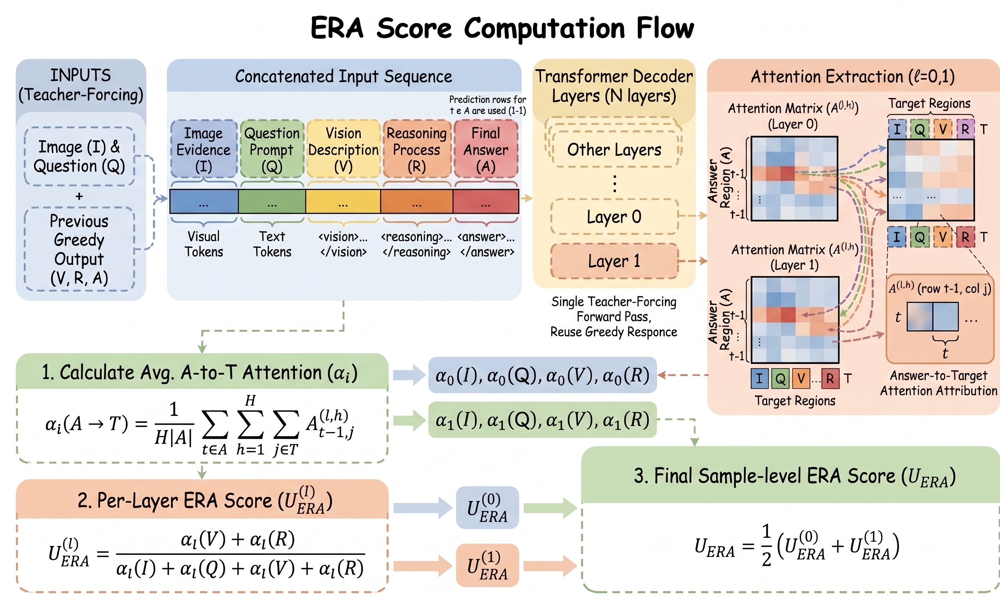

**Step 1：序列重构与拼接。** 对于样本 \(x=(I,Q)\)，读取实验一生成的结构化 greedy 响应 \(Y=(V,R,A)\) 对应的原始 token ID，将 \([I,Q,V,R,A]\) 拼接为完整的 teacher-forcing 输入序列。

**Step 2：单次前向重放。** 在保持原始图像输入 \(I\) 不变的前提下，对拼接序列执行单次 teacher-forcing 前向传播，提取浅层解码器（Layer 0 与 Layer 1）的多头注意力权重矩阵 \(\mathbf{A}^{(l,h)}\)。

**Step 3：区域注意力归因提取。** 针对答案预测行 \(t-1\)（\(t\in A\)），跨注意力头与目标 token 累积流向图像证据 \(I\)、问题提示 \(Q\)、视觉描述 \(V\) 与推理过程 \(R\) 的注意力质量，得到区域归因量 \(\alpha_l(A\rightarrow T)\)。

**Step 4：层级评分与最终聚合。** 按 4.4 节公式计算 Layer 0 和 Layer 1 的内生归因比重 \(U_{\mathrm{ERA}}^{(0)}\) 与 \(U_{\mathrm{ERA}}^{(1)}\)，取二者均值获得样本级 ERA 不确定性分数 \(U_{\mathrm{ERA}} = \frac{1}{2}(U_{\mathrm{ERA}}^{(0)} + U_{\mathrm{ERA}}^{(1)})\)。

与基于重复采样的一致性方法相比，ERA 的新增计算开销仅为对既有 greedy 响应进行一次完整前向重放，不需要生成任何额外候选答案。

## 5 实验二：实验结果对比与分析

### 5.1 ERA 幻觉检测性能

本节在第 3.5 节构建的低不确定性困难子集上评估 ERA。每个模型的测试子集均包含 200 条低不确定性幻觉样本和 200 条经三种基线 UQ 分数分布匹配的非幻觉样本，低不确定性幻觉记为正类。ERA 使用第 0 层和第 1 层的平均归因分数，并与 PPL、SE 和 UMPIRE 在完全相同的样本集合上比较。表 5.1 同时列出四种方法的 AUROC、AUPRC 与 PRR，以及 ERA 相对各指标最优基线的提升。

**表 5.1：ERA 与三种基线在低不确定性困难子集上的幻觉检测性能及相对最优基线的提升。每个模型包含 400 条样本；加粗表示该行最优结果。**

| 模型 | 指标 | PPL | SE | UMPIRE | ERA | 最优基线 | 绝对提升 | 相对提升 |
|---|---|---:|---:|---:|---:|---|---:|---:|
| LLaVA | AUROC | 0.402 | 0.476 | 0.413 | **0.708** | SE | +0.232 | +48.7% |
|  | AUPRC | 0.435 | 0.464 | 0.437 | **0.719** | SE | +0.255 | +54.9% |
|  | PRR | −0.228 | −0.035 | −0.141 | **0.473** | SE | +0.509 | — |
| Qwen | AUROC | 0.485 | 0.499 | 0.477 | **0.618** | SE | +0.119 | +23.9% |
|  | AUPRC | 0.499 | 0.496 | 0.489 | **0.610** | PPL | +0.112 | +22.4% |
|  | PRR | −0.054 | −0.001 | −0.042 | **0.290** | SE | +0.291 | — |
| InternVL | AUROC | 0.489 | 0.498 | 0.502 | **0.591** | UMPIRE | +0.088 | +17.6% |
|  | AUPRC | 0.498 | 0.500 | 0.502 | **0.602** | UMPIRE | +0.100 | +20.0% |
|  | PRR | −0.025 | −0.002 | 0.003 | **0.187** | UMPIRE | +0.184 | — |

ERA 在三个模型和三项指标上均优于相应的最优基线。LLaVA 上的提升最为明显，AUROC 由 0.476 提高至 0.708，AUPRC 由 0.464 提高至 0.719；Qwen 的 AUROC 和 AUPRC 分别达到 0.618 和 0.610；InternVL 的对应结果为 0.591 和 0.602。相较最优基线，ERA 在三个模型上的 AUROC 绝对提升依次为 0.232、0.119 和 0.088，AUPRC 绝对提升依次为 0.255、0.112 和 0.100。

PRR 给出了与 AUROC 和 AUPRC 一致的结果：三种基线在困难子集上的 PRR 均接近零或为负，而 ERA 分别达到 0.473、0.290 和 0.187，对应绝对提升为 0.509、0.291 和 0.184。由于最优基线 PRR 接近零或为负，其比例变化会受到分母影响而失去稳定意义，因此表中不报告 PRR 的相对百分比。总体而言，在传统 UQ 分数已经显式匹配的困难条件下，ERA 仍能恢复对低不确定性幻觉的有效排序，说明答案形成早期的信息来源结构提供了三种基线未能捕获的区分信号。

为排除困难子集中正、负类正确率差异对上述结果的混杂影响，附录 A.7 进一步在答案正确与错误样本内分别评估 ERA；Decoder Layer 与归因分量消融分别见附录 A.5 和 A.6，XML 格式适配消融见附录 A.4。

### 5.2 ERA 分数的区分能力

为进一步考察 ERA 的区分能力，图 5.2 比较了三个模型中低不确定性幻觉（LUH）与匹配非幻觉样本的 ERA 分数分布，表 5.2 则将分布位置与跨模型排序指标合并汇总。由于不同模型的网络结构和注意力尺度不同，本节主要比较同一模型内部两类样本的相对位置，不直接使用统一的绝对分数阈值进行跨模型判断。

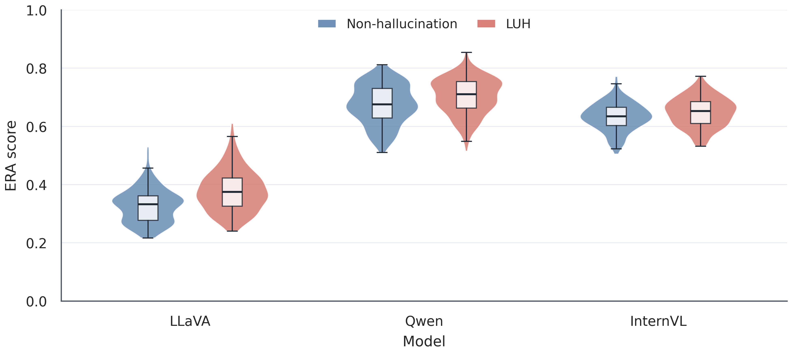

**图 5.2：三个模型中 LUH 与非幻觉样本的 ERA 分数分布。小提琴宽度表示核密度；内部箱体表示四分位区间，中线表示中位数，须线延伸至 1.5 倍四分位距内的最远观测。每个模型的每类样本均为 $n=200$。**

**表 5.2：LUH 与非幻觉样本的 ERA 分布差异及跨模型一致性。每组 $n=200$，表中不含置信区间。**

| 模型 | LUH 中位数（Q1–Q3） | 非幻觉中位数（Q1–Q3） | 中位数差 | AUROC | Cliff's delta |
|---|---:|---:|---:|---:|---:|
| LLaVA | 0.3746（0.3260–0.4227） | 0.3324（0.2772–0.3618） | +0.0422 | 0.708 | 0.416 |
| Qwen | 0.7105（0.6630–0.7541） | 0.6756（0.6292–0.7308） | +0.0350 | 0.618 | 0.236 |
| InternVL | 0.6529（0.6102–0.6855） | 0.6343（0.6032–0.6661） | +0.0186 | 0.591 | 0.181 |

如图 5.2 所示，三个模型的 LUH 分布均相对非幻觉样本向高分方向移动，与 ERA 将更强内部推理依赖映射为更高不确定性分数的定义一致。LLaVA 的分布位移最明显，其中位数由 0.3324 提高至 0.3746；Qwen 和 InternVL 的中位数差分别为 0.0350 和 0.0186，两类分布存在更多重叠，但整体方向保持一致。

表 5.2 中的 AUROC 与 Cliff's delta 进一步给出不依赖绝对阈值的跨模型比较。三个模型的 Cliff's delta 均为正，AUROC 也均高于随机水平，其中 LLaVA、Qwen 和 InternVL 依次为 0.708、0.618 和 0.591。这一排序与第 5.1 节的检测结果一致，表明 ERA 对 LUH 的分数抬升并非由单一模型驱动，而是在三种模型结构上呈现相同方向；与此同时，效应量从 LLaVA 到 InternVL 逐渐减小，说明不同模型中的可分程度仍存在差异。

这一模型差异也与第 3.3 节的 LUH 规模量化结果相呼应。在严格的 \(\alpha=0.25\) 阈值下，LLaVA 在三种 UQ 方法下分别包含 206–292 条 LUH，而 InternVL 仅包含 45–120 条；当阈值放宽至 \(\alpha=0.50\) 时，两者的范围分别为 595–680 条和 193–324 条。由此可见，LLaVA 的低不确定性幻觉盲区规模最大，InternVL 最小，Qwen 整体位于二者之间，这与 ERA 在 LLaVA 上提升最大、在 InternVL 上提升相对有限的现象保持一致。结合第 3.1 节的总体幻觉率，LLaVA、Qwen 和 InternVL 分别为 0.679、0.358 和 0.322；随着模型本身的幻觉率降低，可供 ERA 识别的幻觉失效模式相应减少，因此，ERA 在幻觉率最高的 LLaVA 上能够获得更明显的分数位移和性能提升，而在幻觉率最低的 InternVL 上额外提升相对有限。

### 5.3 典型案例分析

本节选取三个代表性样本，分别展示传统基线未能突出而 ERA 成功识别、传统方法与 ERA 均保持低不确定性、以及 ERA 未能识别幻觉的情形。各百分位均在对应模型的 400 条困难子集内部计算，数值越高表示方法认为样本越不确定。

**案例 1（LLaVA / HallusionBench，基线漏检、ERA 成功）。** 问题要求根据几何图形判断点 $M$ 是否为三角形 $ABC$ 的外心：

**表 5.3.1：案例 1 样本信息与模型回答。**

| 字段 | 内容 |
|---|---|
| 样本 | `hallusionbench-image-VD-math-11-1-1` |
| 问题 | If AM=BM=CM, then is M the circumcenter of triangle ABC? Please answer yes or no. |
| 参考答案 | Yes；M is the circumcenter of triangle ABC. |
| 模型回答 | `<vision>` The image shows a triangle with the letters A, M, and F on its sides. The letters A, M, and F are arranged in a row along the base of the triangle, and the letters B, C, and D are arranged in a row along the height of the triangle. The letters F and M are positioned at the bottom corners of the triangle, and the letters A and B are positioned at the top corners. The letters C and D are positioned in the middle of the triangle. `</vision>` → `<reasoning>` The letters A, B, C, and D are arranged in a row along the height of the triangle, and the letters F and M are arranged in a row along the base. The letters F and M are at the bottom corners, and the letters A and B are at the top corners. The letters C and D are in the middle of the triangle. Since the letters A, B, C, and D are arranged in a row along the height, and the letters F and M are arranged in a row along the base, the letters F and M must be at the circumcenter of the triangle. Therefore, the answer is yes. `</reasoning>` → `<answer>` yes |
| Judge | rating 1，`vision_hallucination` + `reasoning_hallucination`（视觉观察错误识别图中标记，并据此构造不受图像支持的推理） |
| 基线分数（百分位） | PPL 1.000750（0.5225）；SE 0.000000（0.2113）；UMPIRE −44.838590（0.1325） |
| ERA 归因 | 外部区域 0.3822；内部区域 0.5412；ERA 0.586430（0.9975 百分位） |

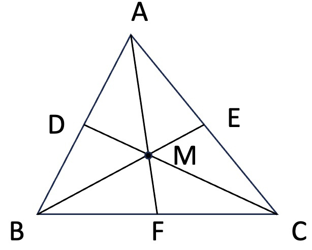

模型虽然给出了与参考答案相同的“yes”，但其视觉观察混淆了图中的顶点和线段标记，推理过程也不是由题设 $AM=BM=CM$ 正确推出，而是建立在错误的图形描述上，因此仍被标注为幻觉。SE 与 UMPIRE 将其排在较低不确定性区域，PPL 也未将其列为高风险样本；相比之下，答案 token 对内部视觉描述与推理区域的归因高于图像和问题区域，使 ERA 达到 0.586，并位于 LLaVA 子集的 99.75 百分位，从而成功突出该样本。

**案例 2（LLaVA / ViLP，正常低不确定性样本）。** 问题询问图中用于清扫地面的物品，图像直接给出了清晰的扫帚证据：

**表 5.3.2：案例 2 样本信息与模型回答。**

| 字段 | 内容 |
|---|---|
| 样本 | `vilp-103-case1` |
| 问题 | Floors are cleaned using a broom. Which item in the image is used for sweeping or mopping? |
| 参考答案 | Broom |
| 模型回答 | `<vision>` A man is sweeping a broom across a wooden floor. `</vision>` → `<reasoning>` The object being used for sweeping is a broom. `</reasoning>` → `<answer>` broom |
| Judge | rating 6，`hallucination=false`（视觉观察、推理和答案均与图像一致） |
| 基线分数（百分位） | PPL 1.000143（0.0763）；SE 0.000000（0.2113）；UMPIRE −43.984397（0.1825） |
| ERA 归因 | 外部区域 0.7132；内部区域 0.1945；ERA 0.216579（0.0025 百分位） |


该样本的图像证据与问题目标直接对应，视觉观察只保留了回答所需的“人物正在用扫帚清扫地板”，没有引入额外事实。答案 token 对图像和问题区域的归因明显高于对内部生成内容的归因，因此 ERA 仅为 0.217，处于 LLaVA 子集的 0.25 百分位。该案例说明 ERA 并不会将所有生成稳定、分数较低的回答视为异常；当模型的确定性确实来自外部证据时，ERA 与三种基线均保持低不确定性判断。

**案例 3（Qwen / ViLP，ERA 失败）。** 问题要求统计图中蜘蛛的腿数，参考答案为 10，但模型错误地回答为 16：

**表 5.3.3：案例 3 样本信息与模型回答。**

| 字段 | 内容 |
|---|---|
| 样本 | `vilp-17-case2` |
| 问题 | Spiders usually have 8 legs. How many legs does the spider in the image have? |
| 参考答案 | 10 |
| 模型回答 | `<vision>` The image shows a large, detailed spider with eight pairs of legs. `</vision>` → `<reasoning>` Counting the legs reveals a total of 16 legs. `</reasoning>` → `<answer>` 16 |
| Judge | rating 1，`vision_hallucination` + `reasoning_hallucination`（将图中的 10 条腿错误描述为 8 对，并据此得到 16） |
| 基线分数（百分位） | PPL 1.000597（0.5800）；SE 0.640192（0.9625）；UMPIRE −44.946982（0.2875） |
| ERA 归因 | 外部区域 0.3394；内部区域 0.4143；ERA 0.549097（0.0250 百分位） |


该回答的错误发生在细粒度视觉计数阶段。虽然模型把 10 条腿错误识别为 8 对，但答案形成时仍保留了对图像与问题区域的注意，因此内部归因占比没有上升到 Qwen 的高分区域，ERA 仅位于 2.5 百分位并发生漏检。与之相对，SE 位于 96.25 百分位，表明多次采样在该计数问题上存在明显语义分歧。该案例揭示了 ERA 的边界：它衡量答案依赖外部证据还是自生成推理，却不能直接判断模型所关注的视觉证据是否被正确读取；当幻觉来自局部识别或计数错误、同时归因路径仍指向图像时，ERA 仍可能给出较低分数。

综合三个案例，ERA 的优势主要体现在识别“答案过度依赖内部视觉描述与推理”的低不确定性幻觉，而正常低不确定性回答通常保持更高的外部证据归因。其失效则主要出现在模型确实关注了图像、但对局部视觉内容作出错误解释的情形。因而，ERA 补充的是传统概率、采样一致性与内部表征方法缺少的证据来源信息，但并不能替代对视觉证据内容正确性的直接验证。

## 6 局限性与下一步工作

### 6.1 局限性

**XML 格式适配的影响具有模型差异。** 本文通过格式 LoRA 规范视觉观察、推理与最终答案的组织方式，并冻结视觉编码器、多模态投影层及其余基础参数，以尽量降低格式学习对模型原有能力的干扰。然而，附录 A.4 的配对消融表明，XML 格式适配对正确率和幻觉率的影响随模型而变化，因而不能将其视为对模型能力完全中性的处理。此外，当前比较仅覆盖原生模型能够完整生成三段式回答的配对样本，格式规范带来的评测稳定性收益与微调本身引起的能力变化仍需进一步区分。

**困难子集上的结论不能直接外推至完整分布。** ERA 目前主要在经过 PPL、SE 和 UMPIRE 分数分布匹配的 LUH 困难子集上验证。该设计能够检验 ERA 是否提供传统 UQ 信号之外的增量信息，但困难子集并不等同于完整数据分布。因此，现有结果主要支持 ERA 对低不确定性幻觉的识别能力，尚不足以说明其在全部正确、错误、幻觉与非幻觉样本上的综合检测性能。

**证据来源归因不能替代视觉内容核验。** ERA 衡量最终答案对外部输入与模型内部生成内容的相对依赖，但不直接判断模型是否正确理解了所关注的视觉证据。当模型仍依赖图像和问题，却在局部目标识别、OCR、细粒度计数或图表读数中出现错误时，ERA 仍可能给出较低分数。因此，ERA 能够揭示模型是否过度依赖自生成描述与推理，却不能独立完成对视觉内容正确性的验证。

**裁判标签仍可能包含共同偏差。** 本文采用 GPT-5.6-Terra 与 Gemini-3.7-Flash 独立裁判，并对分歧字段进行人工盲裁，但两个 Judge 达成一致并不意味着标签必然正确。当前人工仲裁主要覆盖裁判分歧样本，对一致样本中的共同偏差缺少系统核查；裁判模型、提示词与幻觉判定标准的变化也可能影响最终标签。

### 6.2 下一步工作

下一步将把 ERA 从当前 LUH 困难子集扩展到三个完整检测数据集，并在统一的正确性与幻觉标签下评估全部样本。核心目标不是仅提高 LUH 的识别率，而是在保留 ERA 对低不确定性幻觉敏感性的同时，不损失基础不确定性量化方法对一般错误和一般幻觉的检测能力。

为实现这一目标，后续将探索 ERA 与 PPL、SE、UMPIRE 等传统 UQ 信号的互补融合。传统方法分别刻画生成概率、跨采样语义分歧和内部表征稳定性，ERA 则补充模型确定性是否真正来源于外部视觉证据。后续评估将同时报告完整数据集与 LUH 子集上的检测、排序和校准结果，并进一步检验组合方法在不同模型与数据集之间的稳定性。

## 附录 A：补充说明与消融实验

### A.1 评测数据集介绍

**ViLP。** ViLP 用于检验视觉语言模型是否会被问题文本诱导的语言先验支配。Hugging Face 数据包含 300 个不同问题，每个问题对应三张图像和三个配对答案：一个 Prior Answer 和两个要求结合文本与视觉证据才能得到的 Test Answer，共形成 900 个 QIA 问题实例（每个 QIA 为一行，图像以二进制列存储于 `ViLP.parquet`）。本实验展开全部三组配对，每个 QIA 都作为独立推理实例；在分组统计和 bootstrap 时仍以原始问题 ID 聚类，避免把同题的三组实例视为完全独立。官方答案通常为单词；本实验允许选项、数值、词语、短语和短句。


> **样本：** `vilp-1-case2`<br>
> **问题：** A soccer ball is typically a sphere. What is the geometric shape of the large soccer ball in the image?<br>
> **参考答案：** Cube

该样本先在问题中强调“足球通常为球形”这一强语言先验，再让图像呈现一个立方体足球。模型只有抑制常识诱导并依据视觉证据判断形状，才能得到正确答案，体现了 ViLP 通过图文冲突诊断语言先验依赖的核心特点。

**HallusionBench。** HallusionBench 是一个针对语言幻觉与视觉错觉纠缠问题的诊断基准，包含 1,129 个问题实例：`image` split 951 个、`non_image` split 178 个。数据覆盖 Visual Dependent（VD，视觉依赖，如错视、图表、OCR 与数学图形）与 Visual Supplement（VS，视觉补充，如图表、地图、表格与视频帧）两大类及其子类别（figure、chart、map、table、ocr、illusion、math、video），并包含语言幻觉与关联问题组；GT 主要为 Yes/No，并提供 `gt_answer_details`。本实验使用两个 split 的全集；对 `non_image` 或 `visual_input=0` 的实例不额外传入图像。由于后续改进方法需要视觉 token，这些无图样本在 LUH 子集提取时被排除（见 2.5.1）。

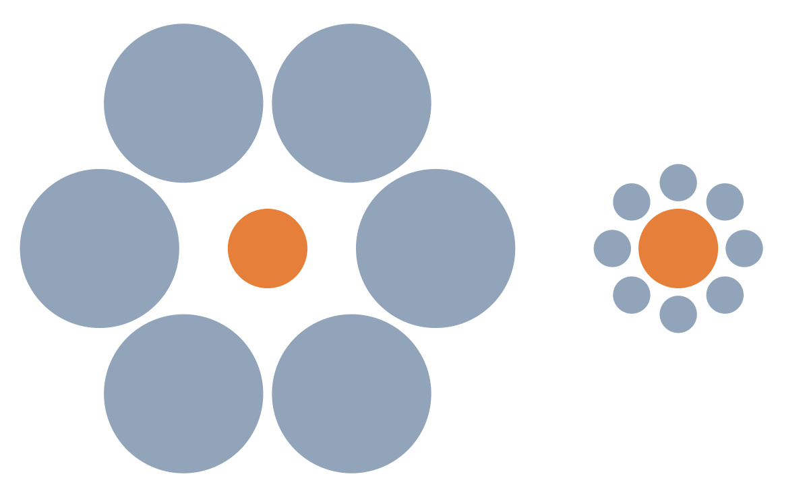

> **样本：** `hallusionbench-image-VD-illusion-0-0-0`<br>
> **问题：** Is the right orange circle the same size as the left orange circle?<br>
> **参考答案：** Yes

两个橙色圆的实际尺寸相同，但不同大小的环绕圆会造成明显的视错觉；同一图像还配有“右侧更大”和“右侧更小”等关联问题。该样本体现了 HallusionBench 通过成组 Yes/No 问题区分真实视觉属性与感知错觉的诊断特点。

**MM-Vet。** MM-Vet 的 `test` split 包含 218 个问题，每题对应一张图像和一个开放式参考答案，综合覆盖 recognition（识别）、OCR、knowledge（知识）、spatial awareness（空间感知）、language generation（语言生成）与 math（数学）六项核心能力及其组合（如 OCR+math）。参考答案可能是词语、数字、列表、短句或说明性描述；本实验允许所有上述答案形式，并统一按 `<answer>` 内容与参考答案做语义一致性判定。该数据集的图像来源多样，包括网页图像、截图和真实场景照片。


> **样本：** `mmvet-v1_8`（capability：recognition + OCR + spatial awareness + math）<br>
> **问题：** What will the girl on the right write on the board?<br>
> **参考答案：** 14

回答者需要先识别两名女孩中位于右侧的人，再定位她正在补全的中间算式 `7×2=`，最后完成乘法计算。该样本体现了 MM-Vet 以开放式回答联合考察目标识别、文字读取、空间定位与数学推理，而非仅测试单一能力的特点。

### A.2 提示词与 NLI 语义判别配置

**A.2.1 XML-LoRA 回答指令（prompt style：`xml_lora`）。** 当前生成流程从 `prompts/LoRA/xml_lora_instruction.md` 读取指令，并依次在同一条 user message 中放入回答指令、可选图像标记和问题：

```text
Answer using exactly these three XML tags once and in order, with no line breaks
and no text outside them: <vision>relevant visible evidence</vision><reasoning>brief
reasoning</reasoning><answer>concise final answer</answer>

[Image]
The image is attached to this message.

[Question]
{official_question}
```

**A.2.2 Judge 系统提示词（`closed_source_judge`）。** 当前实现从 `prompts/judge/closed_source_judge.md` 读取以下原文，正式运行记录保存其 SHA-256：

```text
You are an impartial judge for a multimodal response organized into visual
observations, reasoning, and a final answer.

Task 1: Hallucination
Judge hallucination only from the visual observations and reasoning parts. Multimodal
hallucination means content inconsistent with the image, question, context, or
facts; it is not the same as every error. Calculation mistakes, flawed reasoning,
or wrong formulas are usually general/reasoning errors. Fabricating nonexistent
objects, attributes, relations, numbers, conditions, evidence, or introducing
unsupported premises/rules/facts is hallucination.

Use the full 0-6 scale:
- Rating 6: very informative with good analysis or reasoning, no hallucination.
- Rating 5: very informative, no hallucination.
- Rating 4: somewhat informative, no hallucination.
- Rating 3: not informative, no hallucination.
- Rating 2: very informative, with hallucination.
- Rating 1: somewhat informative, with hallucination.
- Rating 0: not informative, with hallucination.

The hallucination label MUST follow this threshold:
- rating 0, 1, or 2 => hallucination=true.
- rating 3, 4, 5, or 6 => hallucination=false.

If hallucination=true, hallucination_types must be "vision_hallucination" for
false visual observations, "reasoning_hallucination" for unsupported reasoning
claims, or both.

Task 2: Correctness
Judge correctness only from the final answer part. Compare it with the ground
truth provided in the user prompt.
```

**A.2.3 Judge 用户提示词与输出格式。** 原图、问题、参考答案与被测模型原始回答作为同一 user message 传入：

```text
[Image]
{official_image}

[Question]
{official_question}

[Ground Truth]
{gt_answer}

[Model Answer]
{raw_response}

Return only a JSON object. It must include the correctness label, hallucination
label, 0-6 hallucination rating, hallucination type label, and a brief reason.

Format example:
{
  "correct": true,
  "hallucination": false,
  "rating": 4,
  "hallucination_types": [],
  "reason": "The answer matches the ground truth, and no hallucination is found."
}
```

**A.2.4 NLI 语义判别模型配置。** Semantic Entropy 使用本地 sequence-classification checkpoint `DeBERTa-v3-large`。模型与 tokenizer 均通过 Hugging Face Transformers 以 `local_files_only=true` 离线加载，正式任务使用 CUDA、batch size 32；输入按 batch 动态 padding，并依照 tokenizer 的最大长度执行 truncation。程序从 checkpoint 的 `id2label` 中自动识别唯一的 `entailment` 类，以 logits 的 argmax 作为蕴含判定，不另设概率阈值。

聚类时，每个答案先被组织为 `Question: {question}\nAnswer: {answer}`，从而在相同问题上下文中比较含义。完全相同的文本直接归入同一簇；其余答案只与各语义簇代表进行双向 NLI，两个方向均判为 entailment 时才合并，否则建立新簇。该 NLI 模型只服务于 Semantic Entropy 的语义等价判断，不生成正式的正确性或幻觉标签。

### A.3 LoRA 格式微调

格式微调数据来自 VQAv2 train2014 官方问题、人工答案和对应 COCO 图像。候选样本要求多数答案至少获得 7 名标注者一致支持，并按问题类型进行均衡抽样，每张图像最多保留一个问题。最终选取 5,000 个互不重复的“图像—问题”实例，以随机种子 42 划分为 4,000 条训练样本和 1,000 条验证样本，两个集合之间不存在问题或图像重叠。Qwen3.7-Plus 根据真实图像、问题和 VQAv2 多数答案生成与问题相关的视觉证据和简短推理；生成内容经字段完整性、答案一致性和文本格式检查后，统一封装为单行 `<vision>...</vision><reasoning>...</reasoning><answer>...</answer>` 监督目标。

三个模型分别训练独立的 LoRA adapter，但共享相同的数据划分、目标格式和核心优化设置。LoRA 只作用于语言模型注意力层的 `q_proj` 与 `v_proj`，视觉编码器、多模态投影层及其余基础参数保持冻结。训练损失仅计算模型回答部分，使微调主要学习视觉观察、推理和最终答案的稳定组织方式，而不是重新学习正式评测任务。LLaVA 和 Qwen 的最大序列长度为 1,024，InternVL 为 4,096；这一差异用于适配各模型原生输入长度，其余主要训练配置见表 A.3。

**表 A.3：LoRA 格式微调配置与验证结果。**

| 配置项 | LLaVA-1.5-7B | Qwen2.5-VL-7B-Instruct | InternVL3.5-8B |
|---|---:|---:|---:|
| 训练 / 验证样本 | 4,000 / 1,000 | 4,000 / 1,000 | 4,000 / 1,000 |
| LoRA rank / alpha / dropout | 8 / 16 / 0.05 | 8 / 16 / 0.05 | 8 / 16 / 0.05 |
| 目标模块 | `q_proj`, `v_proj` | `q_proj`, `v_proj` | `q_proj`, `v_proj` |
| 学习率 / 训练轮数 | $2\times10^{-4}$ / 1 | $2\times10^{-4}$ / 1 | $2\times10^{-4}$ / 1 |
| 有效 batch size | 16 | 16 | 16 |
| 最大序列长度 | 1,024 | 1,024 | 4,096 |
| 最终验证 loss | 0.7647 | 0.6935 | 0.6573 |

正式实验统一使用单个训练轮次结束后的 adapter，不利用 ViLP、HallusionBench 或 MM-Vet 选择训练版本。格式微调是否改变模型原有的正确率和幻觉率，则通过附录 A.4 的配对消融单独检验。


### A.4 XML 格式适配消融

为检验格式 LoRA 是否改变模型原有的回答能力，本消融先从三个模型均能完整生成 XML 回答的共同样本池中，以固定随机种子不放回抽取 500 条问题实例，其中 ViLP、HallusionBench 和 MM-Vet 分别占 204、243 和 53 条。XML-LoRA 条件复用主实验的 greedy 回答及其 Gemini-3.7-Flash Judge 标签；原生条件不加载 adapter，仅通过提示词要求模型依次给出视觉观察、推理和最终答案，其完整原始回答同样由 Gemini-3.7-Flash 裁判。两种条件均采用 greedy 解码，并使用相同的 Judge 模型与 Judge Prompt。

内容指标仅在原生回答实际完整包含视觉观察、推理和最终答案三段的样本上比较。筛选后，LLaVA、Qwen 和 InternVL 分别保留 217、473 和 500 个配对样本。表 A.4 报告这些模型内配对样本上的正确率和幻觉率。差值定义为“XML-LoRA − 原生”，置信区间采用以 `group_id` 为聚类单位的 1,000 次 bootstrap，$p$ 值来自精确 McNemar 检验。

**表 A.4：XML 格式 LoRA 与原生提示条件的配对比较。括号内为差值的 95% bootstrap 置信区间。**

| 模型 | 配对数 | XML 正确率 | 原生正确率 | 正确率差值 | $p$ | XML 幻觉率 | 原生幻觉率 | 幻觉率差值 | $p$ |
|---|---:|---:|---:|---:|---:|---:|---:|---:|---:|
| LLaVA | 217 | 46.1% | 44.2% | +1.8（−4.1, +8.3） | 0.672 | 65.0% | 51.2% | +13.8（+6.3, +21.0） | <0.001 |
| Qwen | 473 | 66.4% | 67.7% | −1.3（−4.8, +2.4） | 0.576 | 28.3% | 27.9% | +0.4（−3.4, +4.5） | 0.919 |
| InternVL | 500 | 68.4% | 73.8% | −5.4（−9.5, −1.8） | 0.008 | 29.6% | 22.4% | +7.2（+3.2, +11.4） | <0.001 |

在原生回答遵循三段结构的样本中，LLaVA 与 Qwen 的正确率差值均不显著；InternVL 的 XML-LoRA 正确率低 5.4 个百分点，显示格式微调的影响具有模型差异。幻觉率方面，Qwen 两种条件之间无显著差异，而 LLaVA 与 InternVL 的 XML-LoRA 条件分别高 13.8 和 7.2 个百分点。


### A.5 Decoder Layer 消融

为检验 ERA 对层选择的敏感性，分别使用单个早期层、多个早期层、中间层、末层以及全部 Decoder Layer 计算 ERA。表 A.5 报告各代表性层组合的点估计与 95% group-bootstrap 置信区间。

**表 A.5：不同 Decoder Layer 组合下的 ERA 检测性能。加粗表示同一模型、同一指标的最优结果。**

| 模型 | 层组合 | 层编号 | AUROC（95% CI） | AUPRC（95% CI） | PRR（95% CI） |
|---|---|---|---:|---:|---:|
| LLaVA | Layer 0 | 0 | **0.715 (0.654, 0.769)** | **0.722 (0.644, 0.789)** | **0.487 (0.365, 0.596)** |
|  | Layer 1 | 1 | 0.699 (0.632, 0.753) | 0.714 (0.631, 0.782) | 0.451 (0.311, 0.570) |
|  | Layers 0–1 | 0, 1 | 0.708 (0.643, 0.762) | 0.719 (0.638, 0.788) | 0.473 (0.340, 0.585) |
|  | Layers 0–3 | 0–3 | 0.707 (0.644, 0.761) | 0.718 (0.635, 0.785) | 0.471 (0.338, 0.583) |
|  | Middle 2 | 15, 16 | 0.550 (0.491, 0.608) | 0.545 (0.472, 0.627) | 0.153 (0.015, 0.293) |
|  | Final 2 | 30, 31 | 0.676 (0.609, 0.730) | 0.667 (0.584, 0.742) | 0.393 (0.250, 0.509) |
|  | All layers | 0–31 | 0.640 (0.572, 0.702) | 0.650 (0.561, 0.730) | 0.307 (0.161, 0.440) |
| Qwen | Layer 0 | 0 | 0.616 (0.554, 0.672) | **0.615 (0.530, 0.697)** | 0.268 (0.117, 0.391) |
|  | Layer 1 | 1 | 0.616 (0.558, 0.671) | 0.599 (0.521, 0.679) | **0.301 (0.164, 0.423)** |
|  | Layers 0–1 | 0, 1 | **0.618 (0.558, 0.673)** | 0.610 (0.528, 0.691) | 0.290 (0.150, 0.413) |
|  | Layers 0–3 | 0–3 | 0.610 (0.551, 0.667) | 0.599 (0.517, 0.680) | 0.276 (0.138, 0.401) |
|  | Middle 2 | 13, 14 | 0.473 (0.409, 0.537) | 0.495 (0.424, 0.576) | −0.138 (−0.284, 0.005) |
|  | Final 2 | 26, 27 | 0.538 (0.471, 0.599) | 0.536 (0.459, 0.621) | 0.026 (−0.132, 0.184) |
|  | All layers | 0–27 | 0.569 (0.506, 0.629) | 0.555 (0.475, 0.641) | 0.186 (0.034, 0.329) |
| InternVL | Layer 0 | 0 | 0.586 (0.530, 0.645) | 0.585 (0.515, 0.677) | **0.196 (0.062, 0.328)** |
|  | Layer 1 | 1 | **0.595 (0.539, 0.653)** | **0.610 (0.537, 0.700)** | 0.172 (0.027, 0.317) |
|  | Layers 0–1 | 0, 1 | 0.591 (0.535, 0.649) | 0.602 (0.531, 0.692) | 0.187 (0.049, 0.320) |
|  | Layers 0–3 | 0–3 | 0.573 (0.519, 0.633) | 0.584 (0.514, 0.674) | 0.157 (0.012, 0.295) |
|  | Middle 2 | 17, 18 | 0.456 (0.395, 0.513) | 0.483 (0.417, 0.563) | −0.127 (−0.266, 0.021) |
|  | Final 2 | 34, 35 | 0.543 (0.484, 0.600) | 0.533 (0.463, 0.618) | 0.061 (−0.095, 0.200) |
|  | All layers | 0–35 | 0.503 (0.446, 0.562) | 0.498 (0.435, 0.574) | −0.013 (−0.156, 0.129) |

早期层在三个模型上整体取得更高的检测性能，而中间层和全层平均会明显削弱区分能力。基于跨模型稳定性，正文实验固定使用第 0 层和第 1 层的平均分数，而不针对单个模型分别选择最优层。

### A.6 Vision / Reasoning 归因分量消融

表 A.6 比较完整的 Vision + Reasoning 内部归因、仅 Vision 归因以及仅 Reasoning 归因，并报告 95% group-bootstrap 置信区间。三种变体均采用第 0 层和第 1 层。

**表 A.6：Vision / Reasoning 归因分量消融结果。加粗表示同一模型、同一指标的最优结果。**

| 模型 | 归因分量 | AUROC（95% CI） | AUPRC（95% CI） | PRR（95% CI） |
|---|---|---:|---:|---:|
| LLaVA | Vision + Reasoning | 0.708 (0.643, 0.762) | 0.719 (0.638, 0.788) | **0.473 (0.340, 0.585)** |
|  | Vision only | **0.713 (0.655, 0.763)** | **0.719 (0.646, 0.786)** | 0.458 (0.325, 0.577) |
|  | Reasoning only | 0.655 (0.588, 0.717) | 0.675 (0.587, 0.756) | 0.344 (0.202, 0.482) |
| Qwen | Vision + Reasoning | 0.618 (0.558, 0.673) | 0.610 (0.528, 0.691) | 0.290 (0.150, 0.413) |
|  | Vision only | 0.582 (0.521, 0.643) | 0.581 (0.500, 0.667) | 0.153 (−0.012, 0.316) |
|  | Reasoning only | **0.621 (0.560, 0.677)** | **0.616 (0.531, 0.699)** | **0.299 (0.160, 0.423)** |
| InternVL | Vision + Reasoning | **0.591 (0.535, 0.649)** | **0.602 (0.531, 0.692)** | **0.187 (0.049, 0.320)** |
|  | Vision only | 0.565 (0.511, 0.621) | 0.569 (0.499, 0.647) | 0.141 (−0.007, 0.282) |
|  | Reasoning only | 0.588 (0.531, 0.650) | 0.596 (0.526, 0.687) | 0.177 (0.036, 0.316) |

单一分量的最优结果随模型变化：LLaVA 更依赖 Vision 分量，Qwen 的 Reasoning-only 结果略高，而 InternVL 由组合分数取得最佳结果。Vision + Reasoning 虽未在每个单元格中均达到最高值，但在三个模型上保持了更稳定的整体性能，因此作为 ERA 的统一定义。

### A.7 按答案正确性分层的 ERA 消融

困难子集中的 LUH 正类与非幻觉负类具有不同的答案正确率。为检验 ERA 的区分能力是否仅由这一差异驱动，本消融保持原有 400 条模型内困难子集不变，分别在正确样本（$C=1$）和错误样本（$C=0$）中，以幻觉为正类重新计算 ERA 的 AUROC、AUPRC 与 PRR。表 A.7 同时报告每层的幻觉与非幻觉样本数；置信区间采用 1,000 次 group-bootstrap。

**表 A.7：答案正确性分层后的 ERA 幻觉检测性能。H / non-H 为幻觉与非幻觉样本数。**

| 模型 | 正确性分层 | $n$ | H / non-H | AUROC（95% CI） | AUPRC（95% CI） | PRR（95% CI） |
|---|---|---:|---:|---:|---:|---:|
| LLaVA | 正确（$C=1$） | 278 | 82 / 196 | 0.717 (0.645, 0.783) | 0.551 (0.444, 0.659) | 0.558 (0.424, 0.672) |
|  | 错误（$C=0$） | 122 | 118 / 4 | 0.642 (0.522, 0.757) | 0.985 (0.967, 0.996) | 0.012 (−0.076, 0.121) |
| Qwen | 正确（$C=1$） | 280 | 88 / 192 | 0.700 (0.623, 0.771) | 0.507 (0.394, 0.634) | 0.503 (0.337, 0.642) |
|  | 错误（$C=0$） | 120 | 112 / 8 | 0.528 (0.330, 0.728) | 0.943 (0.881, 0.987) | 0.011 (−0.186, 0.264) |
| InternVL | 正确（$C=1$） | 274 | 95 / 179 | 0.693 (0.621, 0.758) | 0.545 (0.445, 0.659) | 0.446 (0.269, 0.596) |
|  | 错误（$C=0$） | 126 | 105 / 21 | 0.511 (0.376, 0.646) | 0.849 (0.767, 0.925) | 0.039 (−0.200, 0.279) |

在答案正确样本内，三个模型的 AUROC 仍达到 0.717、0.700 和 0.693，且置信区间下界均高于 0.5；这表明 ERA 能够区分“最终答案正确但推理包含幻觉”的样本与正确且无幻觉的样本，其总体优势并非答案正确性差异的替代信号。在答案错误样本内，LLaVA 仍保留一定区分度，而 Qwen 与 InternVL 接近随机水平。需要注意，该层的非幻觉样本仅有 4、8 和 21 条，类别极度不平衡，使置信区间较宽；其较高 AUPRC 主要受幻觉正类占比很高影响，不应直接与正确样本层的 AUPRC 横向比较。

## 附录 B：实验详细数据

### B.1 正确性与幻觉标签详细统计

**表 B.1a：各模型正确性与幻觉标签联合分布。括号内为该模型有效样本中的比例。**

| 模型 | 正确且无幻觉 | 正确且有幻觉 | 错误且无幻觉 | 错误且有幻觉 | 合计 |
|---|---:|---:|---:|---:|---:|
| LLaVA | 624 (28.2%) | 466 (21.1%) | 86 (3.9%) | 1,034 (46.8%) | 2,210 |
| Qwen | 1,189 (53.7%) | 240 (10.8%) | 232 (10.5%) | 554 (25.0%) | 2,215 |
| InternVL | 1,249 (55.7%) | 226 (10.1%) | 272 (12.1%) | 495 (22.1%) | 2,242 |
| 总体 | 3,062 (45.9%) | 932 (14.0%) | 590 (8.8%) | 2,083 (31.2%) | 6,667 |

**表 B.1b：答案正确与错误条件下的幻觉率。**

| 模型 | \(P(H=1\mid C=1)\) | \(P(H=1\mid C=0)\) |
|---|---:|---:|
| LLaVA | 42.8% | 92.3% |
| Qwen | 16.8% | 70.5% |
| InternVL | 15.3% | 64.5% |

**表 B.1c：各模型幻觉样本的类型构成。括号内为该模型幻觉样本中的比例。**

| 模型 | 纯视觉型 | 纯推理型 | 双重型 | 幻觉样本合计 |
|---|---:|---:|---:|---:|
| LLaVA | 267 (17.8%) | 183 (12.2%) | 1,050 (70.0%) | 1,500 |
| Qwen | 147 (18.5%) | 225 (28.3%) | 422 (53.1%) | 794 |
| InternVL | 158 (21.9%) | 169 (23.4%) | 394 (54.6%) | 721 |
| 总体 | 572 (19.0%) | 577 (19.1%) | 1,866 (61.9%) | 3,015 |

### B.2 错误检测 AUROC 详细结果

**表 B.2：错误检测（正类 \(E=1-C\)）AUROC（95% bootstrap 置信区间）。**

| 模型 × 数据集 | PPL | SE | UMPIRE |
|---|---|---|---|
| llava / vilp | 0.575 (0.540, 0.611) | **0.655** (0.622, 0.690) | 0.609 (0.573, 0.645) |
| llava / hallusionbench | 0.567 (0.538, 0.595) | 0.553 (0.519, 0.586) | **0.579** (0.547, 0.612) |
| llava / mmvet | 0.758 (0.671, 0.834) | **0.808** (0.727, 0.875) | 0.786 (0.696, 0.861) |
| qwen / vilp | 0.612 (0.578, 0.649) | **0.717** (0.680, 0.750) | 0.653 (0.617, 0.687) |
| qwen / hallusionbench | 0.643 (0.607, 0.677) | **0.653** (0.615, 0.693) | 0.629 (0.589, 0.668) |
| qwen / mmvet | 0.717 (0.650, 0.785) | **0.816** (0.759, 0.870) | 0.769 (0.704, 0.831) |
| internvl / vilp | 0.622 (0.591, 0.657) | **0.719** (0.686, 0.752) | 0.640 (0.608, 0.675) |
| internvl / hallusionbench | 0.708 (0.674, 0.741) | **0.746** (0.713, 0.777) | 0.674 (0.635, 0.712) |
| internvl / mmvet | 0.724 (0.654, 0.791) | **0.847** (0.790, 0.899) | 0.828 (0.765, 0.886) |
| 九格均值 | 0.658 | **0.724** | 0.685 |

### B.3 幻觉检测 AUROC 详细结果

**表 B.3：幻觉检测（正类 \(H\)）AUROC（95% bootstrap 置信区间）。**

| 模型 × 数据集 | PPL | SE | UMPIRE |
|---|---|---|---|
| llava / vilp | 0.541 (0.504, 0.580) | **0.605** (0.569, 0.640) | 0.570 (0.531, 0.609) |
| llava / hallusionbench | 0.607 (0.565, 0.646) | 0.568 (0.518, 0.620) | **0.588** (0.541, 0.633) |
| llava / mmvet | 0.567 (0.475, 0.651) | **0.697** (0.618, 0.769) | 0.679 (0.592, 0.758) |
| qwen / vilp | 0.501 (0.458, 0.544) | **0.609** (0.565, 0.647) | 0.546 (0.501, 0.594) |
| qwen / hallusionbench | 0.558 (0.511, 0.602) | **0.639** (0.602, 0.680) | 0.613 (0.569, 0.658) |
| qwen / mmvet | 0.536 (0.455, 0.621) | **0.659** (0.567, 0.740) | 0.576 (0.489, 0.664) |
| internvl / vilp | 0.533 (0.492, 0.575) | **0.657** (0.617, 0.696) | 0.563 (0.525, 0.603) |
| internvl / hallusionbench | 0.640 (0.595, 0.685) | **0.686** (0.647, 0.722) | 0.661 (0.616, 0.701) |
| internvl / mmvet | 0.632 (0.544, 0.710) | **0.779** (0.706, 0.845) | 0.720 (0.645, 0.779) |
| 九格均值 | 0.568 | **0.655** | 0.613 |

#### B.3.1 幻觉与错误检测性能差距详细结果

**表 B.3.1：AUROC(H) − AUROC(E) 配对差距（95% bootstrap 置信区间）。**

| 模型 × 数据集 | PPL | SE | UMPIRE |
|---|---|---|---|
| llava / vilp | −0.033 (−0.066, 0.003) | −0.050 (−0.083, −0.020) | −0.039 (−0.073, −0.005) |
| llava / hallusionbench | +0.040 (−0.004, 0.085) | +0.015 (−0.027, 0.059) | +0.009 (−0.033, 0.052) |
| llava / mmvet | −0.191 (−0.279, −0.107) | −0.111 (−0.186, −0.035) | −0.106 (−0.186, −0.030) |
| qwen / vilp | −0.112 (−0.149, −0.072) | −0.109 (−0.145, −0.072) | −0.107 (−0.143, −0.071) |
| qwen / hallusionbench | −0.085 (−0.124, −0.043) | −0.013 (−0.045, 0.019) | −0.015 (−0.049, 0.015) |
| qwen / mmvet | −0.181 (−0.263, −0.100) | −0.157 (−0.238, −0.074) | −0.193 (−0.276, −0.106) |
| internvl / vilp | −0.089 (−0.130, −0.047) | −0.062 (−0.101, −0.023) | −0.077 (−0.113, −0.041) |
| internvl / hallusionbench | −0.067 (−0.104, −0.031) | −0.060 (−0.093, −0.027) | −0.013 (−0.051, 0.022) |
| internvl / mmvet | −0.092 (−0.162, −0.020) | −0.068 (−0.144, 0.004) | −0.108 (−0.179, −0.043) |

#### B.3.2 困难子集构建详细结果

**表 B.3.2a：正负类在三种 UQ 方法上的百分位对齐与配对距离（正类 / 负类）。**

| 模型 | PPL 百分位 | SE 百分位 | UMPIRE 百分位 | 配对距离中位数 | 配对距离 90 分位 |
|---|---:|---:|---:|---:|---:|
| LLaVA | 0.168 / 0.215 | 0.171 / 0.195 | 0.133 / 0.171 | 0.082 | 0.175 |
| Qwen | 0.242 / 0.249 | 0.306 / 0.310 | 0.219 / 0.230 | 0.020 | 0.091 |
| InternVL | 0.304 / 0.310 | 0.357 / 0.358 | 0.343 / 0.345 | 0.029 | 0.084 |

**表 B.3.2b：候选池与困难子集组成（子集列均为正类 / 负类，每类各 200 条）。**

| 模型 | 候选池（总数 / 幻觉 / 非幻觉） | ViLP | HallusionBench | MM-Vet | 答案正确率 | 正类幻觉类型（视觉 / 推理 / 双重） |
|---|---:|---:|---:|---:|---:|---:|
| LLaVA | 2,036 / 1,389 / 647 | 49 / 109 | 145 / 73 | 6 / 18 | 0.410 / 0.980 | 41 / 7 / 152 |
| Qwen | 2,037 / 708 / 1,329 | 37 / 82 | 152 / 104 | 11 / 14 | 0.440 / 0.960 | 49 / 7 / 144 |
| InternVL | 2,064 / 636 / 1,428 | 49 / 64 | 148 / 113 | 3 / 23 | 0.475 / 0.895 | 61 / 5 / 134 |

三个模型的正类幻觉率均为 100%，负类均不含 rating≤2 的样本。正类中的双重型幻觉占主导，而正负类在三种 UQ 方法上的分数百分位保持较好对齐。

### B.4 数据排除记录

**表 B.4：各单元格的生成、XML 有效与排除情况。排除原因均为 XML 格式解析失败。**

| 模型 | 数据集 | 生成数 | 纳入评估数 | 排除数 |
|---|---|---:|---:|---:|
| llava | vilp | 900 | 886 | 14 |
| llava | hallusionbench | 1,129 | 1,108 | 21 |
| llava | mmvet | 218 | 216 | 2 |
| qwen | vilp | 900 | 898 | 2 |
| qwen | hallusionbench | 1,129 | 1,099 | 30 |
| qwen | mmvet | 218 | 218 | 0 |
| internvl | vilp | 900 | 900 | 0 |
| internvl | hallusionbench | 1,129 | 1,126 | 3 |
| internvl | mmvet | 218 | 216 | 2 |
| 合计 |  | 6,741 | 6,667 | 74 |

### B.5 双 Judge 一致性与人工仲裁统计

表 B.5a 分别报告 GPT-5.6-Terra 与 Gemini-3.7-Flash 在正确性和幻觉字段上的原始一致率与 Cohen's $\kappa$。所有统计均在两个 Judge 都返回有效标签、且最终进入正式评估的 6,667 条 greedy 回答上计算，人工仲裁前的原始标签用于一致性分析。

**表 B.5a：双 Judge 的字段级 agreement rate 与 Cohen's $\kappa$。**

| 模型 | $n$ | 正确性 agreement | 正确性 $\kappa$ | 幻觉 agreement | 幻觉 $\kappa$ |
|---|---:|---:|---:|---:|---:|
| LLaVA | 2,210 | 98.69% | 0.974 | 86.74% | 0.713 |
| Qwen | 2,215 | 97.20% | 0.939 | 85.87% | 0.676 |
| InternVL | 2,242 | 96.92% | 0.930 | 86.98% | 0.697 |
| 总体 | 6,667 | 97.60% | 0.950 | 86.53% | 0.725 |

**表 B.5b：送入人工盲裁的冲突字段与唯一样本数。**

| 模型 | 正确性冲突字段 | 幻觉冲突字段 | 两字段同时冲突 | 人工仲裁唯一样本 |
|---|---:|---:|---:|---:|
| LLaVA | 29 | 293 | 8 | 314 |
| Qwen | 62 | 313 | 17 | 358 |
| InternVL | 69 | 292 | 20 | 341 |
| 总体 | 160 | 898 | 45 | 1,013 |

正确性字段在三个模型上的一致率均超过 96.9%，$\kappa$ 均高于 0.93；幻觉判断的一致率约为 86%，$\kappa$ 为 0.676–0.713，说明幻觉判定较答案正确性更具主观难度。人工工作量按字段统计时为 1,058 次裁决，但 45 条样本同时包含两个冲突字段，因此实际进入人工界面的唯一样本为 1,013 条。

---

## 参考文献

[1] Li Y., Du Y., Zhou K., Wang J., Zhao W. X., Wen J.-R. Evaluating Object Hallucination in Large Vision-Language Models[C]. EMNLP, 2023.（POPE）

[2] Kuhn L., Gal Y., Farquhar S. Semantic Uncertainty: Linguistic Invariances for Uncertainty Estimation in Natural Language Generation[C]. ICLR, 2023.

[3] Zhang R., Zhang H., Zheng Z. VL-Uncertainty: Detecting Hallucination in Large Vision-Language Model via Uncertainty Estimation[EB/OL]. arXiv:2411.11919, 2024.

[4] Park S., Oh C., Choi H. K., Du S., Li S. VAUQ: Vision-Aware Uncertainty Quantification for LVLM Self-Evaluation[EB/OL]. arXiv:2602.21054, 2026.

[5] Lau G. K. R., Dao H., Lin N. K. H., Low B. K. H. Uncertainty Quantification for Multimodal Large Language Models with Incoherence-adjusted Semantic Volume[EB/OL]. arXiv:2602.24195, 2026.（UMPIRE）

[6] Huy T. D., Nguyen T., Chowdhury T., Yadav A., To M.-S., Liao Z., Verjans J. W., Phan V. M. H. Visual Semantic Entropy: Do Vision Language Models Recognize Visual Ambiguity?[EB/OL]. arXiv:2606.31407, 2026.

[7] Agnimo Y., Korba A., Blangero A., Chesneau N., Alahari K. Evaluating the Relevance of Uncertainty Estimators for LLM Hallucination[EB/OL]. arXiv:2605.27016, 2026.

[8] Sun Z., Shen S., Cao S., Liu H., Li C., Shen Y., Gan C., Gui L.-Y., Wang Y.-X., Yang Y., Keutzer K., Darrell T. Aligning Large Multimodal Models with Factually Augmented RLHF[EB/OL]. arXiv:2309.14525, 2023.（MMHal-Bench）

[9] Guan T., Liu F., Wu X., Xian R., Li Z., Liu X., Wang X., Chen L., Huang F., Yacoob Y., Manocha D., Zhou T. HallusionBench: An Advanced Diagnostic Suite for Entangled Language Hallucination and Visual Illusion in Large Vision-Language Models[C]. CVPR, 2024.

[10] Liu X., Chen T., Da L., Chen C., Lin Z., Wei H. Uncertainty Quantification and Confidence Calibration in Large Language Models: A Survey[EB/OL]. arXiv:2503.15850, 2025.

[11] Malinin A., Gales M. Uncertainty Estimation in Autoregressive Structured Prediction[C]. ICLR, 2021.

[12] Kadavath S., Conerly T., Askell A., et al. Language Models (Mostly) Know What They Know[EB/OL]. arXiv:2207.05221, 2022.（P(True)）

[13] Nikitin A., Kossen J., Gal Y., Marttinen P. Kernel Language Entropy: Fine-grained Uncertainty Quantification for LLMs from Semantic Similarities[C]. NeurIPS, 2024.

[14] Lin Z., Trivedi S., Sun J. Generating with Confidence: Uncertainty Quantification for Black-box Large Language Models[EB/OL]. arXiv:2305.19187, 2023.（Eccentricity、Degree）

[15] Chen C., Liu K., Chen Z., Gu Y., Wu Y., Tao M., Fu Z., Ye J. INSIDE: LLMs' Internal States Retain the Power of Hallucination Detection[EB/OL]. arXiv:2402.03744, 2024.（EigenScore）

[16] Azaria A., Mitchell T. The Internal State of an LLM Knows When It's Lying[C]. EMNLP, 2023.

[17] Gao X., Zhang J., Mouatadid L., Das K. SPUQ: Perturbation-Based Uncertainty Quantification for Large Language Models[C]. EACL, 2024.

[18] Rohrbach A., Hendricks L. A., Burns K., Darrell T., Saenko K. Object Hallucination in Image Captioning[C]. EMNLP, 2018.（CHAIR）

[19] Fu C., Chen P., Shen Y., et al. MME: A Comprehensive Evaluation Benchmark for Multimodal Large Language Models[EB/OL]. arXiv:2306.13394, 2023.

[20] Liu F., Lin K., Li L., Wang J., Yacoob Y., Wang L. Mitigating Hallucination in Large Multi-Modal Models via Robust Instruction Tuning[EB/OL]. arXiv:2306.14565, 2023.（GAVIE）

[21] Wang J., Zhou Y., Xu G., et al. Evaluation and Analysis of Hallucination in Large Vision-Language Models[EB/OL]. arXiv:2308.15126, 2023.（HaELM）

[22] Zhang M., Press O., Merrill W., Liu A., Smith N. A. How Language Model Hallucinations Can Snowball[C]. ICML, 2024.（幻觉滚雪球）

[23] Shi W., Han X., Lewis M., Tsvetkov Y., Zettlemoyer L., Yih S. W.-t. Trusting Your Evidence: Hallucinate Less with Context-Aware Decoding[C]. NAACL, 2024.（CAD）

[24] Huang Q., Dong X., Fu J., et al. OPERA: Alleviating Hallucination in Multi-Modal Large Language Models via Over-Trust Penalty and Retrospection-Allocation[C]. CVPR, 2024.（OPERA）

[25] Belrose N., Ostrovsky I., McKinney L., et al. Eliciting Latent Predictions from Transformers with the Tuned Lens[EB/OL]. arXiv:2303.08112, 2023.（Tuned Lens）

[26] Liu H., Li C., Li Y., Lee Y. J. Improved Baselines with Visual Instruction Tuning[C]. CVPR, 2024.（LLaVA-1.5）

[27] Qwen Team. Qwen2.5-VL Technical Report[EB/OL]. arXiv:2502.13923, 2025.

[28] Wang W., Gao Z., Gu L., et al. InternVL3.5: Advancing Open-Source Multimodal Models in Versatility, Reasoning, and Efficiency[EB/OL]. arXiv:2508.18265, 2025.

[29] Luo T., Cao A., Lee G., Johnson J., Lee H. Probing Visual Language Priors in VLMs[C]. ICML, 2025.（ViLP）

[30] Yu W., Yang Z., Li L., et al. MM-Vet: Evaluating Large Multimodal Models for Integrated Capabilities[C]. ICML, 2024.

[31] Goyal Y., Khot T., Summers-Stay D., Batra D., Parikh D. Making the V in VQA Matter: Elevating the Role of Image Understanding with Complex Questions and Common Sense[C]. CVPR, 2017.（VQAv2）

[32] Hu E. J., Shen Y., Wallis P., et al. LoRA: Low-Rank Adaptation of Large Language Models[C]. ICLR, 2022.
